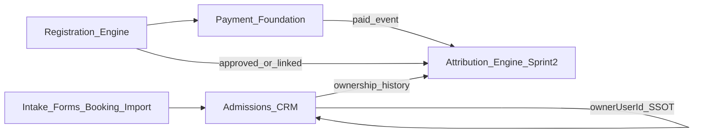

# Admissions CRM v2 — Foundation Architecture

**Status:** Repository architecture canon (recreated in-repo)  
**Depends on:** [Product Blueprint](./00-product-blueprint.md)

[Index](./README.md) · Previous: [Product Blueprint](./00-product-blueprint.md) · Next: [Technical Specifications](./02-technical-specifications.md)

---

## 1. Purpose

Define bounded contexts and the ownership / attribution spine so Sprint 1–2 implementers extend one architecture instead of inventing parallel CRM money or ownership systems.

## 2. Bounded contexts

| Context | Responsibility |
|---------|----------------|
| **Admissions CRM** | Leads, stages, tasks, notes, **current owner** |
| **Registration Engine** | Enrollment applications, status, documents |
| **Payment Foundation** | `PaymentIntent`, sessions, verify, receipt |
| **Attribution Engine (Sprint 2)** | History, policies, revenue credit, snapshots |

## 3. Ownership SSOT (Truth Spine)

- **Live owner:** `Lead.ownerUserId` → `User` (`LeadOwner` relation).
- **Canonical write path after create:** `lib/crm/lead-ownership.ts` (`setLeadOwner` / bulk variants).
- **Intake paths** may set the initial owner at create time, then all subsequent changes use the ownership service.
- **Event trail (today):** `CrmActivity` (`OWNER_ASSIGNED`) and optional `AuditLog` — useful for audit UI, not a full temporal history model.

## 4. Event trail vs history tables

| Mechanism | Mutable? | Use |
|-----------|----------|-----|
| `Lead.ownerUserId` | Yes | Current owner for filters, board, RBAC scope |
| `CrmActivity` / `AuditLog` | Append-only events | Human-readable trail; not optimized for period queries |
| Ownership history (Sprint 2) | Append-only periods | “Who owned between T1–T2?” |
| Attribution snapshots (Sprint 2) | Immutable after create | Frozen credit at revenue time |

Sprint 2 must **not** treat activity JSON alone as the attribution ledger.

## 5. Integration points

### CRM → Attribution

- Ownership changes emit durable history rows (Sprint 2).
- Source tags already exist conceptually: `MANUAL`, `BULK`, `AUTOMATION`, `IMPORT`, `SYSTEM`.

### Payment → Attribution

- Successful payment verification / paid registration is a primary trigger to create an **attribution snapshot**.
- Reuse existing Payment Foundation; do not create a second gateway or intent model.

### Registration → Attribution

- Registration linked to a lead (`Registration.leadId`) supplies the lead context for attribution.
- Amounts come from registration / payment fields already stored in UTC Rials.

## 6. Explicit non-duplication

- Do not invent a second “CRM payment” table.
- Do not fork Form Builder into CRM.
- Do not bypass `lead-ownership.ts` for owner updates.
- Product & Service Flows / Registration Flows remain outside this CRM ownership spine except as revenue sources.

## 7. Document links

- [README (index)](./README.md)
- Previous: [00 — Product Blueprint](./00-product-blueprint.md)
- Next: [02 — Technical Specifications](./02-technical-specifications.md)
- Sprint 1: [03 — Truth Spine](./03-sprint-1-truth-spine.md)
- Sprint 2 (spec only): [04 — Attribution Engine](./04-sprint-2-attribution-engine.md)
