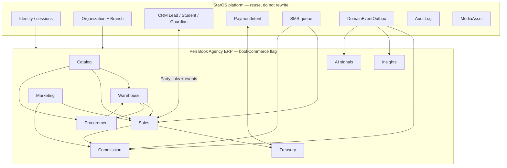
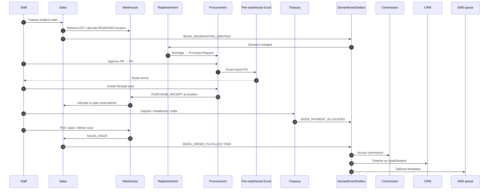

# 01 — Overview: Pen Book Agency ERP

**Status:** v2 architecture — awaiting **implementation** approval  
**Flag:** `bookCommerce` = OFF

[Index](./README.md) · Previous: [Current state](./00-current-state.md) · Next: [Domain model](./02-domain-model.md)

---

## 1. Product definition

Pen Book Agency ERP is the operating system of an **educational book distribution agency** (آژانس کتاب قلم / کانون فرهنگی آموزش):

- The agency **does not manufacture** books.
- The agency **sells** published books to students, parents, schools, and walk-ins.
- Demand often appears **before** stock: a student orders, stock is reserved (or marked as need), the agency **purchases from the Pen / publisher warehouse**, goods arrive, reservation is fulfilled, remainder and deposits are collected, teachers/consultants earn commission, schools run campaigns.

That is procurement-driven distribution with education-channel growth — **not** a D2C bookstore.

Success is: nobody sells air, nobody forgets a بیعانه, nobody rebuilds Excel at 11pm, and managers see shortages before the Pen truck is needed.

---

## 2. Design principles (v2)

1. **Additive StarOS module.** No rewrite of booking, CRM, booklet commerce, auth, or existing RBAC maps. New `books.*` permission keys only when coding starts.
2. **`bookCommerce` off by default.** Invisible in production until cutover.
3. **Documents + ledgers.** Every stock and money change is a posted document. Never a lone UPDATE on a quantity column.
4. **Location is mandatory.** Every inventory movement names `Warehouse` + `WarehouseLocation`. Unlimited warehouses.
5. **Demand drives purchase.** Reservations feed the replenishment engine; the engine feeds Purchase Requests; POs are Excel-exported to the Pen warehouse; GRN closes the loop.
6. **Prices are temporal.** Never overwrite list price. Effective-dated price rows.
7. **No duplicated people.** Party links to Lead, Student, Guardian, School, Teacher, Consultant, User, Organization.
8. **Multi-agency from day one.** `organizationId` = one agency tenant. Settings live on `AgencyProfile`, not globals.
9. **Admin ERP first.** Public store is a separate flagged context ([11](./11-public-store.md)).
10. **AI consumes events; it does not write stock or money.**
11. **Persian-first UI, UTC data, integer Rials, Jalali only at edges.**
12. **No Prisma / routes / UI in this pack.**

---

## 3. Bounded context diagram



**Context ownership**

| Context | Owns (write) | Must not own |
|---------|----------------|--------------|
| Catalog | Title, SKU, bundle, barcode, price list, labels | Stock qty, money |
| Warehouse | Locations, movements, balances, transfers, counts, scan sessions | Prices, commissions |
| Procurement | Need, PR, PO, GRN, Pen export | Customer payments |
| Sales | Orders, reservations, delivery, commercial documents | Stock ledger posts except via warehouse services |
| Treasury | Allocations, deposits, installments, receipts, AR | Stock |
| Marketing | Campaigns, coupons, school programs | Commission settlement math (emits rules; commission context posts) |
| Commission | Accrual, lock, payout, partner dashboards read-models | Inventory |
| Insights | Rollups, executive KPIs | OLTP writes |
| AI signals | Feature snapshots from events | Predictions that auto-post PO in v1 |

Booklet shop stays outside this diagram except the shared platform bar.

---

## 4. Event flow diagram



Workers (CLI cron, same style as StarOS SMS/CRM workers):

- `books:import-worker-once`
- `books:reservation-expiry-once`
- `books:replenishment-once`
- `books:commission-worker-once`
- `books:analytics-rollup-once`
- `books:installment-due-once`

Never a long-running daemon in v1. Never post stock inside the HTTP request **and** again in a worker without idempotency keys.

---

## 5. Core operational workflows (index)

Full specs in later docs. Shapes here are canonical.

### 5.1 Warehouse workflow

```text
Receive (scan) → PUTAWAY to location (Shelf / Gift / …)
     → Transfer (warehouse↔warehouse or location↔location)
     → Pick / Pack from Reserved or Shelf
     → Issue (delivery)
     → Return / Damage / Adjust / Cycle count
Every arrow = InventoryMovement with warehouseId + locationId.
```

See [03](./03-warehouse.md).

### 5.2 Reservation workflow

```text
Order confirmed
  → create Reservation (lines)
  → if ATP ≥ qty: hold (soft) and/or move to location kind=RESERVED
  → if ATP < qty: partial hold + shortage lines (demand still counts)
  → TTL / deposit policy firms or expires
  → GRN allocation satisfies shortage
  → pick/pack/deliver converts reservation → issued
```

See [06](./06-sales.md) and [05](./05-procurement.md).

### 5.3 Procurement workflow (agency heart)

```text
Student orders → Reservation
  → Need calculation (demand, on hand, reserved, available, incoming)
  → Purchase Request (auto or manual)
  → Purchase Order
  → Excel export → send to Pen warehouse
  → Books arrive → Goods Receipt (scan)
  → Reservation fulfilled (allocate + notify)
```

See [05](./05-procurement.md).

### 5.4 Sales workflow

```text
Identify Party (student/guardian/school/walk-in)
  → Quotation (optional)
  → Order + Reservation Slip
  → Deposit / installment
  → Fulfill / Delivery note
  → Invoice + Receipt
  → Return Invoice / Credit Note if needed
  → Gift / Donation documents when campaign requires
```

See [06](./06-sales.md) and [09](./09-treasury.md).

### 5.5 Commission workflow

```text
Attribution frozen on first qualifying payment
  → CommissionEntry ACCRUED (paid base, not remaining)
  → delay → LOCKED
  → PAYABLE → wallet or payout batch
  → refund → CLAWBACK per rule
Teacher/Consultant dashboards read snapshots, not live locks.
```

See [08](./08-commission.md).

---

## 6. Multi-agency SaaS (no redesign later)

Today: one agency (`setareganplus` org, Nasim-Shahr branch).

Tomorrow: many Pen-style agencies on one StarOS deployment.

| Mechanism | Rule |
|-----------|------|
| Tenant | `organizationId` on **every** ERP row |
| Agency config | `AgencyProfile` 1:1 with Organization (deposit %, sequences, Pen supplier id, label templates) |
| Isolation | No unscoped Prisma; future RLS can attach to `organization_id` |
| Flag | `bookCommerce` per org — enable agency A without B |
| Identity | Existing User + OrganizationMembership; partner portals are extra links, not a second user table if a User exists |
| Branding | Agency name/logo on print docs from AgencyProfile + MediaAsset |
| Platform admin | `isPlatformAdmin` only for cross-tenant ops (existing meaning) |

Do **not** introduce a parallel `Agency` table that duplicates Organization. The agency **is** the organization. Optional `AgencyProfile` holds book-ERP settings only.

---

## 7. CRM integration (no duplicated master data)

Every sales order stores **links**, not copies:

| Link | When |
|------|------|
| `leadId` | Walk-in / campaign / pre-reg that is still a lead |
| `studentId` | Known institute student |
| `guardianId` | Payer is parent |
| `schoolPartyId` | School bulk / campaign |
| `teacherPartnerId` | Referring teacher |
| `consultantPartnerId` | Referring consultant |
| `customerPartyId` | Always — Party is the sales customer |

Resolution order when capturing an order: Student → Guardian → Lead → create Party.  
CRM receives `BOOK_ORDER_*` domain events and appends `CrmActivity` (additive). Sales **does not** rewrite lead stage except via that event → existing CRM automation if configured.

Teachers/consultants as people: Partner → Party → optional User (for dashboard login later). If they are already `TeamMember` or staff User, link; do not clone.

---

## 8. Proposed additive permissions (not applied now)

When implementation is approved, **add keys**. Do not change existing CRM/booking grants in the same PR beyond appending the new keys to OWNER/ADMIN.

Prefix: `books.*` and `books.marketing.*` / `books.commission.*`.

| Area | Keys |
|------|------|
| Access | `books.view` |
| Catalog | `books.catalog.manage` |
| Labels | `books.labels.print` |
| Import/export | `books.import`, `books.export` |
| Warehouse | `books.inventory.view`, `.manage`, `.count`, `.count_post`, `.adjust`, `.scan` |
| Procurement | `books.procurement.view`, `.manage`, `.approve_pr` |
| Sales | `books.orders.view`, `.manage`, `.fulfill`, `.issue_unpaid` |
| Treasury | `books.finance.view`, `.manage`, `.void` |
| Marketing | `books.marketing.view`, `.campaigns.manage`, `.coupons.manage` |
| Commission | `books.commission.view`, `.manage`, `.payout` |
| Partner portals | `books.partner.teacher`, `books.partner.consultant` |
| Reports | `books.reports.view`, `books.reports.executive` |
| Settings | `books.settings.manage` |

Optional new `SystemRole` values (same future PR, not now): `WAREHOUSE_KEEPER`, `BOOK_CASHIER`, `BOOK_AGENCY_MANAGER`, `PROCUREMENT_OFFICER`. Teachers/consultants do **not** get `/admin` in v1 of portals — they get `/partners/*` later under `bookCommerce.partnerPortals`.

---

## 9. Admin IA (ERP first)

New nav group **بازرگانی کتاب**, hidden unless `bookCommerce` is on:

- نمای کلی اجرایی
- کاتالوگ / بسته‌ها / تاریخچه قیمت / چاپ برچسب
- ورود اکسل
- انبارها و محل‌ها / موجودی / حرکات / انتقال / شمارش
- میز اسکنر
- رزروها
- کمبود و تأمین (PR/PO/GRN)
- سفارش‌های فروش / تحویل
- خزانه (بیعانه، اقساط، مانده)
- اسناد (پیش‌فاکتور تا برگشت از فروش)
- مشتریان (Party)
- بازاریابی و مدارس
- پورسانت معلمان / مشاوران
- گزارش‌ها

Do **not** fold this into booklet «فروشگاه». Do **not** use `/book` (booking).

---

## 10. Target folder map (when code is allowed)

Logical only — **do not create these files now.**

```text
lib/books/{flags,catalog,warehouse,procurement,sales,treasury,import,export,labels,scan,analytics}
lib/books/marketing/
lib/books/commission/
content/books.ts
app/admin/(dashboard)/books/...
app/partners/...          # later, flagged
app/shop/books/...        # later, flagged — never app/book
scripts/books-*-once.ts
```

Booklet `lib/commerce/*` stays booklet. Book ERP does not call `decrementCommerceItemStock`.

---

## 11. Runtime

Same Next.js 16 process, Prisma 7, PostgreSQL, VPS workers. Scalability = location-level balance table + workers + rollups + indexes, not microservices.

---

## 12. Explicit non-goals until later flags

- Public checkout / cart SEO site
- Carrier APIs
- Native mobile apps
- NextAuth
- Auto-posting POs without a human approve
- AI auto-purchasing
- Multi-level pyramid commissions
- Rewriting booklet production kanban
- Touching existing RBAC role grants for CRM/booking
