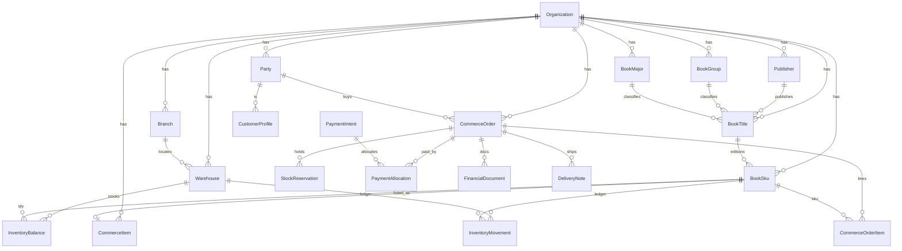
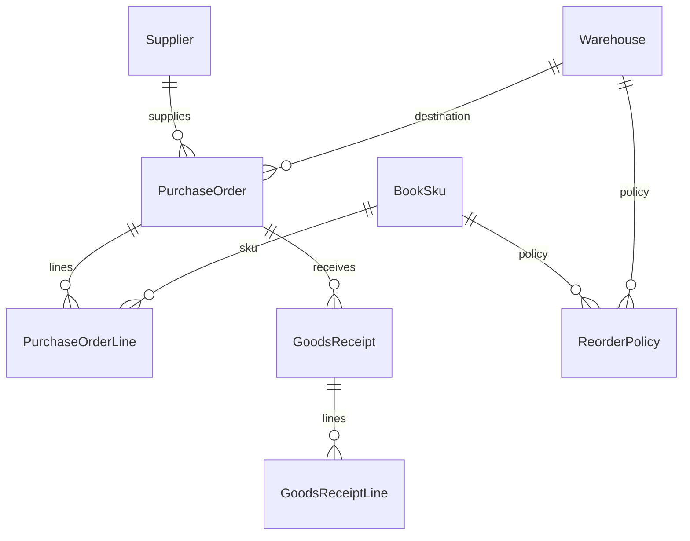

# 02 — Database ERD

**Status:** DRAFT — awaiting approval  
**ORM:** Prisma 7 · **DB:** PostgreSQL  
**Rules:** `organizationId` on every tenant row; composite FKs for branches/warehouses; soft-delete where the row is a master; append-only for ledgers; integer Rials; UTC timestamps.

[Index](./README.md) · Previous: [Architecture](./01-architecture.md) · Next: [Marketing](./03-referral-marketing.md)

This is a **logical** model for implementers. Table names are suggestions (`@@map` snake_case). Do not apply migrations until approval.

If booklet commerce has already merged, **extend** `commerce_items` / `commerce_orders` / `commerce_order_items` with the new columns and child tables. If it has not merged, create them with `productLine` from day one.

---

## 1. Existing tables this ERP must attach to (do not recreate)

```text
organizations
branches
users
organization_memberships
branch_memberships
audit_logs
leads
students
student_guardians
media_assets
payment_intents          (commerce branch; introduce on master if absent)
payment_sessions
payment_event_logs
sms_templates
sms_messages
domain_event_outbox
```

---

## 2. Core ERD — catalog, party, inventory, sales



---

## 3. Catalog

### 3.1 Publisher

| Column | Type | Notes |
|--------|------|--------|
| id | cuid | |
| organizationId | string | |
| name | string | |
| code | string? | unique per org |
| isActive | bool | |
| deletedAt | datetime? | |

Indexes: `@@unique([organizationId, code])`, `@@index([organizationId, isActive])`.

### 3.2 BookGroup / BookMajor

Simple taxonomies (`code`, `name`, `sortOrder`, `isActive`). Major may optionally belong to a group (`groupId?`). Unique `(organizationId, code)`.

### 3.3 BookTitle (work-level)

| Column | Type | Notes |
|--------|------|--------|
| id | cuid | |
| organizationId | string | |
| title | string | |
| subtitle | string? | |
| publisherId | string? | |
| groupId | string? | |
| majorId | string? | |
| description | string | default "" |
| deletedAt | datetime? | |

Indexes: `(organizationId, groupId)`, `(organizationId, majorId)`, `(organizationId, publisherId)`.

### 3.4 BookSku (sellable edition)

| Column | Type | Notes |
|--------|------|--------|
| id | cuid | |
| organizationId | string | |
| titleId | string | |
| internalCode | string | **unique per org** — current agency key |
| barcode | string? | unique per org when not null |
| isbn | string? | |
| editionLabel | string? | |
| editionYear | int? | |
| listPriceRials | int | |
| salePriceRials | int? | |
| status | enum | DRAFT, ACTIVE, INACTIVE, DISCONTINUED |
| allowBackorder | bool | default false |
| trackInventory | bool | default true |
| defaultWarehouseId | string? | |
| coverAssetId | string? | MediaAsset |
| metadata | json? | |
| deletedAt | datetime? | |

**Partial unique indexes (raw SQL — Prisma cannot express):**

```sql
CREATE UNIQUE INDEX book_skus_barcode_not_null
  ON book_skus (organization_id, barcode)
  WHERE barcode IS NOT NULL AND deleted_at IS NULL;

CREATE UNIQUE INDEX book_skus_isbn_not_null
  ON book_skus (organization_id, isbn)
  WHERE isbn IS NOT NULL AND deleted_at IS NULL;
```

Always: `@@unique([organizationId, internalCode])`, `@@unique([organizationId, id])`.

### 3.5 CommerceItem bridge

If using existing `CommerceItem`:

- `productLine` enum: `BOOKLET | BOOK_AGENCY | OTHER`
- `bookSkuId` nullable unique per org
- Keep booklet-specific columns untouched
- `systemKind = PHYSICAL` for books

Do **not** duplicate price as a second source of truth: either SKU price drives item price via service, or item price is the storefront override with SKU list price as master. **Decision for approval:** SKU `listPriceRials` is master; `CommerceItem.salePriceRials` may override for campaigns.

---

## 4. Inventory

### 4.1 Warehouse

| Column | Type | Notes |
|--------|------|--------|
| id | cuid | |
| organizationId | string | |
| branchId | string? | null = central / org-level |
| code | string | unique per org |
| name | string | |
| kind | enum | CENTRAL, BRANCH, TRANSIT, QUARANTINE, SUPPLIER_VIRTUAL |
| isActive | bool | |

`@@unique([organizationId, code])`, `@@unique([organizationId, id])`.  
Composite FK to Branch when `branchId` set.

v1: one `CENTRAL` warehouse is enough to kill “inventory unknown.” TRANSIT is required before inter-branch transfers go live.

### 4.2 InventoryBalance (snapshot)

| Column | Type | Notes |
|--------|------|--------|
| organizationId | string | |
| warehouseId | string | |
| skuId | string | |
| qtyOnHand | int | ≥ 0 |
| qtyReserved | int | ≥ 0 |
| qtyIncoming | int | PO not yet received |
| qtyQuarantine | int | |
| avgCostRials | int? | optional moving average |
| updatedAt | datetime | |

`@@unique([organizationId, warehouseId, skuId])`.

**Invariant in application + CHECK constraints:** `qtyOnHand >= 0`, `qtyReserved >= 0`, `qtyReserved <= qtyOnHand` unless backorder policy is on (if backorder, reserved may exceed on-hand — **prefer not to**; keep reserved ≤ on-hand and use `qtyIncoming` for hope).

### 4.3 InventoryMovement (ledger, append-only)

| Column | Type | Notes |
|--------|------|--------|
| id | cuid | |
| organizationId | string | |
| warehouseId | string | |
| skuId | string | |
| type | enum | see architecture §5.3 |
| qtyDelta | int | signed |
| qtyOnHandAfter | int | |
| qtyReservedAfter | int? | |
| reasonCode | string? | |
| documentType | string | ORDER, PO, COUNT, ADJUST, TRANSFER, RESERVATION |
| documentId | string | |
| reversesMovementId | string? | |
| idempotencyKey | string | unique per org |
| actorUserId | string? | |
| metadata | json? | |
| createdAt | datetime | **no updatedAt** |

Indexes:

- `(organizationId, skuId, createdAt)`
- `(organizationId, warehouseId, createdAt)`
- `(organizationId, documentType, documentId)`
- `@@unique([organizationId, idempotencyKey])`

### 4.4 StockReservation

| Column | Type | Notes |
|--------|------|--------|
| organizationId | string | |
| warehouseId | string | |
| skuId | string | |
| orderId | string | |
| orderItemId | string | |
| quantity | int | |
| status | enum | HELD, FIRM, RELEASED, CONVERTED, EXPIRED |
| expiresAt | datetime? | |
| convertedMovementId | string? | |

Indexes: `(organizationId, status, expiresAt)` for the expiry worker; `(organizationId, orderId)`.

### 4.5 InventoryCount / InventoryCountLine

Header: warehouse, status (`DRAFT, IN_PROGRESS, REVIEW, POSTED, CANCELLED`), countedBy, postedBy, postedAt, freezeBalances bool.

Lines: skuId, qtySystem, qtyCounted, qtyVariance, note.

Posting is the only write that creates movements.

### 4.6 StockAdjustment / StockAdjustmentLine

Header: reasonCode, status, approvedBy. Lines → movements on post.

### 4.7 StockTransfer / StockTransferLine

Header: fromWarehouseId, toWarehouseId, status `DRAFT → SHIPPED → RECEIVED`.  
Ship: `TRANSFER_OUT` + incoming on destination. Receive: `TRANSFER_IN` and clear incoming.

---

## 5. Party / customer

### 5.1 Party

| Column | Type | Notes |
|--------|------|--------|
| organizationId | string | |
| kind | enum | PERSON, ORGANIZATION |
| displayName | string | |
| firstName / lastName | string? | |
| mobile / normalizedMobile | string? | index |
| nationalCode | string? | |
| email | string? | |
| city / province | string? | |
| notes | string? | |
| leadId / userId / studentId / guardianId | string? | links |
| deletedAt | datetime? | |

Indexes: `(organizationId, normalizedMobile)`, `(organizationId, nationalCode)`, `(organizationId, leadId)`, `(organizationId, studentId)`.

### 5.2 CustomerProfile

1:1 with Party. `creditHold`, `defaultBranchId`, `defaultWarehouseId`, `tags` (json or M2M later), `lifetimePaidRials` (projection).

---

## 6. Sales / treasury / delivery

### 6.1 CommerceOrder (book fields)

Additive columns when sharing the booklet order table:

| Column | Type | Notes |
|--------|------|--------|
| productLine | enum | BOOK_AGENCY |
| customerPartyId | string? | |
| salesBranchId | string? | |
| fulfillmentWarehouseId | string? | |
| salesStatus | enum | book pipeline (keep booklet `opsStage` untouched) |
| paidRials | int | |
| remainingRials | int | |
| depositRials | int | |
| balanceDueAt | datetime? | |
| reservedUntil | datetime? | |

Keep booklet columns (`opsStage`, `urgentDelivery`, student grade, etc.) nullable / unused for books.

Indexes: `(organizationId, productLine, salesStatus, createdAt)`, `(organizationId, remainingRials)`, `(organizationId, customerPartyId)`, `(organizationId, buyerMobile)`, unique `(organizationId, orderNumber)`, unique `qrToken` / `shortCode`.

### 6.2 CommerceOrderItem (book fields)

Additive: `skuId`, `internalCodeSnapshot`, `barcodeSnapshot`, `warehouseId`, `qtyReserved`, `qtyIssued`, `qtyReturned`.

### 6.3 PaymentAllocation

| Column | Type | Notes |
|--------|------|--------|
| organizationId | string | |
| paymentIntentId | string | |
| orderId | string | |
| amountRials | int | > 0 |
| allocationKind | enum | DEPOSIT, BALANCE, REFUND |
| createdAt | datetime | |

`@@unique([organizationId, paymentIntentId, orderId, allocationKind])` or allow multiple with event ids — prefer one row per intent×order×kind.

### 6.4 FinancialDocument

| Column | Type | Notes |
|--------|------|--------|
| type | enum | INVOICE, PROFORMA, RECEIPT, CREDIT_NOTE |
| number | string | unique per org+type |
| orderId | string? | |
| partyId | string? | |
| amountRials | int | |
| status | enum | DRAFT, ISSUED, VOID |
| payloadSnapshot | json | print payload |
| qrToken | string? | |

### 6.5 DeliveryNote / DeliveryNoteLine

Header: orderId, method, status, warehouseId, pickupBranchId, deliveredAt, deliveredByUserId, signatureAssetId?, qrToken.  
Lines: orderItemId, skuId, qty.

---

## 7. Procurement



### 7.1 Supplier

org-scoped: name, code, contact, mobile, notes, isActive. Later: default lead time days.

### 7.2 PurchaseOrder / PurchaseOrderLine

Statuses per architecture §5.19. Lines: skuId, qtyOrdered, qtyReceived, unitCostRials, expectedAt.

### 7.3 GoodsReceipt / GoodsReceiptLine

Posting creates `PURCHASE_RECEIPT` movements and decrements `qtyIncoming`.

### 7.4 ReorderPolicy

Unique `(organizationId, warehouseId, skuId)`: `minQty`, `maxQty`, `reorderPoint`, `reorderQty`, `supplierId?`.

---

## 8. Jobs, flags, sequences, analytics

### 8.1 OrganizationFeatureFlag

`(organizationId, key)` unique, `enabled` bool, `payload` json?.

### 8.2 DocumentSequence

`(organizationId, documentType, periodKey)` unique, `nextValue` int. Updated with row lock.

### 8.3 ExcelImportReport

Generic version of `CrmLeadImportReport`: `jobType`, `status` (`PENDING, DRY_RUN, COMMITTING, DONE, FAILED`), counts, `resultCsv` or stored file path under `STAROS_MEDIA_ROOT`, `checksum`, `actorUserId`.

### 8.4 BookAnalyticsDaily

`(organizationId, branchId?, warehouseId?, dimension, dimensionKey, day)` unique. Metrics json or typed ints: gmv, paid, remaining, qtySold, stockouts.

Follow `FormAnalyticsDaily` non-null dimension pattern.

---

## 9. Marketing (see also 03)

Core tables (detail in [03-referral-marketing.md](./03-referral-marketing.md)):

- `Partner` → Party + type
- `Campaign` + `CampaignRewardRule`
- `ReferralLink` + `ReferralQr`
- `Coupon` + `CouponRedemption`
- `CommissionRule` + `CommissionEntry`
- `Wallet` + `WalletLedger`
- `RewardPointAccount` + `RewardPointLedger`
- `PartnerTarget` + `LeaderboardSnapshot`
- `RewardGrant`

All org-scoped; never mix tenants.

---

## 10. Index cookbook (must-have at first migration)

| Table | Index | Why |
|-------|--------|-----|
| book_skus | `(organization_id, internal_code)` unique | scan / import |
| book_skus | `(organization_id, status, deleted_at)` | admin lists |
| inventory_balances | `(organization_id, warehouse_id, sku_id)` unique | ATP |
| inventory_movements | `(organization_id, sku_id, created_at)` | history |
| inventory_movements | `(organization_id, idempotency_key)` unique | safety |
| stock_reservations | `(organization_id, status, expires_at)` | worker |
| commerce_orders | `(organization_id, product_line, sales_status, created_at)` | ops queues |
| commerce_orders | `(organization_id, remaining_rials)` WHERE remaining > 0 | مانده list (partial) |
| payment_allocations | `(organization_id, order_id)` | balance |
| parties | `(organization_id, normalized_mobile)` | lookup |
| excel_import_reports | `(organization_id, created_at)` | admin |

Partial index for open balances:

```sql
CREATE INDEX commerce_orders_open_balance
  ON commerce_orders (organization_id, balance_due_at)
  WHERE remaining_rials > 0 AND product_line = 'BOOK_AGENCY';
```

---

## 11. Referential actions

Match StarOS:

- Master data: `onDelete: Restrict`, soft-delete.
- Ledger rows: no cascade from orders that would destroy financial history — Restrict; void documents instead.
- `PaymentIntent` already Restrict.
- Actor users: `onDelete: SetNull` on event rows (like `AuditLog`).

---

## 12. RLS (future, not v1)

Schema comments on master already allow PostgreSQL RLS later. Book tables should be written so `organization_id` is always present for policies. **Do not** implement RLS in the first delivery; application filters remain mandatory.

---

## 13. Migration packaging (when approved)

Suggested Prisma migration names (do not create now):

1. `book_erp_foundation` — enums, flags, sequences, publishers, groups, majors, titles, skus, warehouses, balances, movements
2. `book_erp_sales_treasury` — party, order additive columns, allocations, financial docs, delivery, reservations
3. `book_erp_procurement` — suppliers, PO, GRN, reorder, counts, adjustments, transfers
4. `book_erp_marketing` — partners, campaigns, wallets, coupons, commissions, points
5. `book_erp_analytics` — daily rollups, extra indexes

Each migration must be **expand-only**. No drops. No renames of booklet columns.
