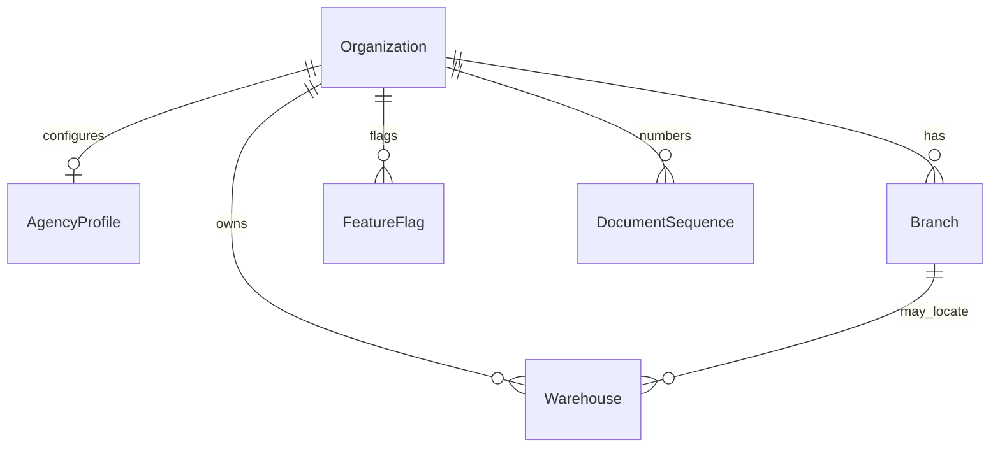
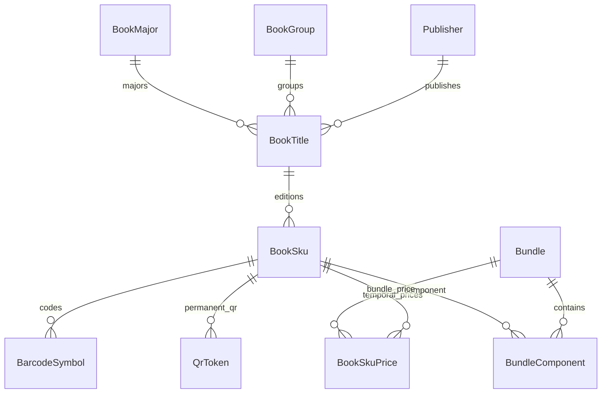
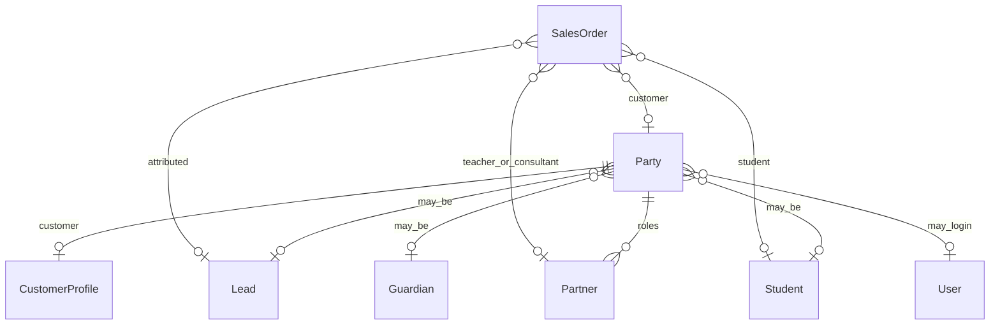
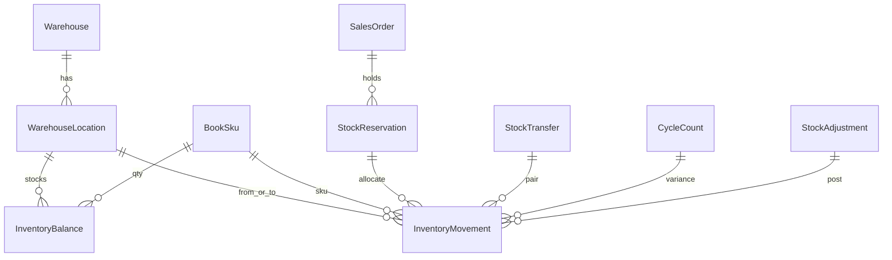
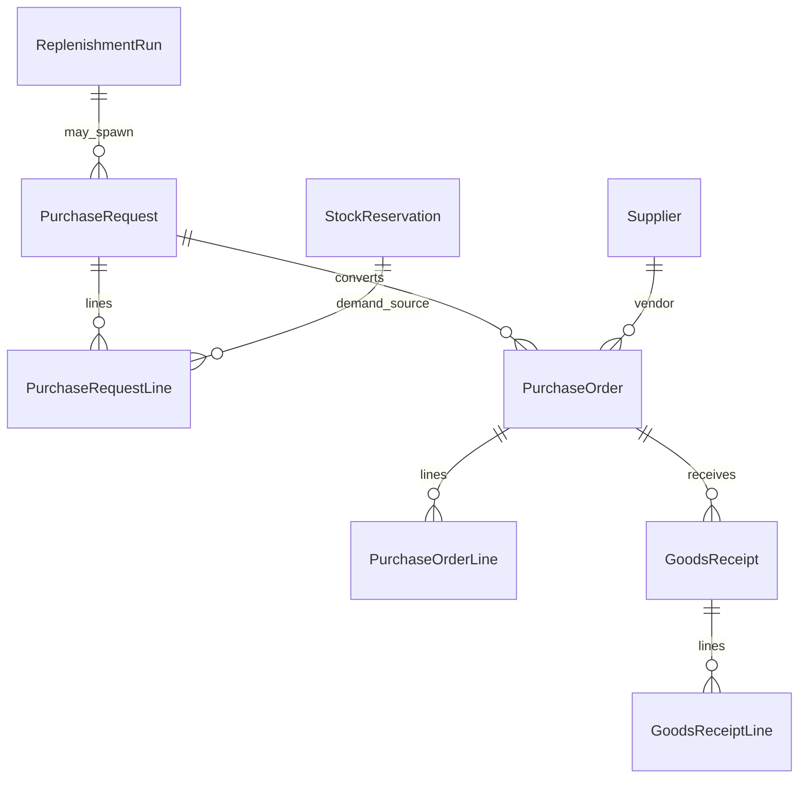
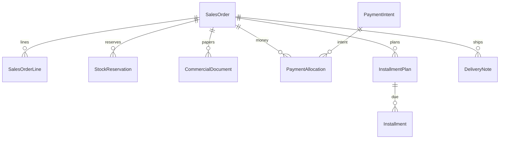

# 02 — Domain Model (logical)

**Status:** v2 — no Prisma, no migrations  
**Rule:** This is the conceptual model implementers must follow when schema is later approved.

[Index](./README.md) · Previous: [Overview](./01-overview.md) · Next: [Warehouse](./03-warehouse.md)

---

## 1. Modeling laws

1. Every tenant row has `organizationId`. Composite FK when `branchId` / `warehouseId` is set.
2. Soft-delete masters (`deletedAt`). Ledgers and posted documents are append-only / voided, never hard-deleted.
3. Money: integer Rials. Qty: integer copies (books are each).
4. Time: UTC in storage; Jalali at UI/Excel/print.
5. Idempotency keys on movements, allocations, import rows, commission entries.
6. `productLine = BOOK_AGENCY` on shared commerce-shaped documents so booklet (جزوه) cannot be confused later.
7. **No scalar stock on SKU.** Quantity exists only on `InventoryBalance` (projection) and `InventoryMovement` (truth).

---

## 2. Entity map (grouped)

```text
TENANCY        Organization, Branch, AgencyProfile, FeatureFlag, DocumentSequence
PARTY          Party, CustomerProfile, Partner
CATALOG        Publisher, BookGroup, BookMajor, BookTitle, BookSku,
               BookSkuPrice, Bundle, BundleComponent, BarcodeSymbol, QrToken
WAREHOUSE      Warehouse, WarehouseLocation, InventoryBalance, InventoryMovement,
               StockReservation, StockTransfer, StockAdjustment, CycleCount, ScanSession
PROCUREMENT    Supplier, ReorderPolicy, ReplenishmentRun, PurchaseRequest,
               PurchaseOrder, GoodsReceipt  (+ line entities)
SALES          SalesOrder, SalesOrderLine, DeliveryNote, CommercialDocument
TREASURY       PaymentAllocation, InstallmentPlan, Installment, Wallet, WalletLedger
MARKETING      Campaign, CampaignRule, Coupon, ReferralLink
COMMISSION     CommissionRule, CommissionEntry, PartnerTarget, LeaderboardSnapshot,
               PartnerDashboardSnapshot
INSIGHTS       BookAnalyticsDaily, AiDemandSignal
JOBS           ExcelImportJob, ExcelImportRowResult, PrintJob
```

Party / Partner / Student / Lead relationships are **links**, not copies.

---

## 3. Tenancy & agency



**AgencyProfile** (1:1 Organization): legal print name, logo, default deposit %, default reservation TTL, default Pen `Supplier` id, allowIssueUnpaid, installment enabled, barcode symbology default, number format patterns.

**FeatureFlag:** key `bookCommerce` and dotted children; `enabled` boolean; optional JSON payload.

**DocumentSequence:** `(organizationId, documentType, periodKey)` → next integer under row lock.

---

## 4. Catalog, price, bundle



**BookSku** identity: `internalCode` unique per org (agency’s current Excel key). Barcode/ISBN unique when present (partial unique). Status independent of stock.

**BookSkuPrice:** `kind` LIST | SALE | BUNDLE_OVERRIDE; `amountRials`; `effectiveFrom`; `effectiveTo` nullable (open-ended); `source` MANUAL | IMPORT | CAMPAIGN. Current price = row covering `now`. Future rows allowed. **Never UPDATE amount in place** — close the old row (`effectiveTo = now`) and insert a new one.

**Bundle:** sellable pack (Medical, Engineering, Gift, Summer, Back to School). `pricingMode` FIXED | SUM_COMPONENTS | SUM_MINUS_PERCENT. `stockMode` see [04](./04-catalog.md): KIT_EXPLODE (ATP = min of components / ratio) or KIT_ASSEMBLED (own balances at location).

**BarcodeSymbol:** one SKU may have publisher EAN + internal Code128.

**QrToken:** permanent, namespaced (`BOOK_SKU`, `WAREHOUSE`, `LOCATION`, `ADMIN_DOC`, `PARTNER_REFERRAL`, `ORDER`, `DELIVERY`). SKU QR never changes when price changes.

---

## 5. Party & CRM links



**PartnerType:** TEACHER, CONSULTANT, SCHOOL, PARENT, STUDENT, AFFILIATE.

Unique `(organizationId, partyId, type)`.

School is Party `kind=ORGANIZATION` + Partner type SCHOOL.

---

## 6. Warehouse & inventory



**Warehouse** (unlimited per org): `kind` CENTRAL | AGENCY | TRANSIT | VIRTUAL_SUPPLIER. Optional `branchId`. Code unique per org. Examples: Central Warehouse, Agency Warehouse.

**WarehouseLocation** (unlimited per warehouse): `kind` + code.

| kind | Purpose |
|------|---------|
| `RECEIVING` | Dock / unsorted inbound |
| `SHELF` | Sellable pick face (example: Shelf) |
| `RESERVED` | Allocated to a reservation (Reserved Stock) |
| `GIFT` | Gift / campaign pool (Gift Stock) |
| `RETURNED` | Customer returns quarantine |
| `DAMAGED` | Unsellable |
| `STAGING` | Pack / outbound |
| `TRANSIT` | In-flight between warehouses |

Sellable ATP locations are configurable on AgencyProfile (default: SHELF only). GIFT/DAMAGED/RETURNED/RESERVED do **not** count as available-to-promise unless a rule says so.

**InventoryBalance:** unique `(organizationId, locationId, skuId)` — **location, not warehouse-only**. Warehouse totals are SUM of locations.

Columns: `qtyOnHand`, `qtyReservedSoft` (ATP holds not yet moved to RESERVED), `qtyIncoming`, `avgCostRials?`.

```text
available(location) = qtyOnHand - qtyReservedSoft   for sellable kinds
available(agency)   = sum(available of sellable locations)
```

**InventoryMovement:** append-only; **always** `locationId` (and warehouseId denormalized for indexes). Signed `qtyDelta`, `qtyOnHandAfter`, `documentType`, `documentId`, `idempotencyKey`, `scanSessionId?`, `actorUserId?`.

Transfers generate two movements (out + in) or TRANSIT pair.

---

## 7. Procurement



**ReplenishmentRun:** snapshot of demand math at `calculatedAt` (auditability for AI later).

**PurchaseRequest:** internal. Status DRAFT → SUBMITTED → APPROVED → CONVERTED / REJECTED / CANCELLED.

**PurchaseOrder:** external to Pen warehouse. Excel export artifact stored (MediaAsset or import-root file). Status includes SENT.

**GoodsReceipt:** posts PURCHASE_RECEIPT into a location (usually RECEIVING then putaway to SHELF, or direct to RESERVED for allocated lines).

---

## 8. Sales, documents, treasury



**SalesOrder** statuses (books): DRAFT → CONFIRMED → PARTIALLY_PAID / PAID / FULFILLING → CLOSED; CANCELLED; ON_HOLD.

**CommercialDocument.type:**

| Type | Persian intent |
|------|----------------|
| `QUOTATION` | پیش‌فاکتور |
| `RESERVATION_SLIP` | برگه رزرو |
| `INVOICE` | فاکتور |
| `RECEIPT` | رسید دریافت |
| `RETURN_INVOICE` | فاکتور برگشت از فروش |
| `CREDIT_NOTE` | اعلامیه بستانکار |
| `GIFT_INVOICE` | فاکتور هدیه (zero or token value) |
| `DONATION_INVOICE` | فاکتور اهداء (school campaigns) |

Documents snapshot amounts; they do not re-price. Numbered via DocumentSequence.

**PaymentAllocation.kind:** DEPOSIT, BALANCE, INSTALLMENT, WALLET, REFUND.

**InstallmentPlan:** n due dates, amounts, late policy. Remaining on order = grandTotal − allocated + refunds (includes unpaid installments).

---

## 9. Marketing & commission

Campaign, CampaignRule, Coupon, ReferralLink, ReferralQr (QrToken namespace), RewardGrant — see [07](./07-marketing.md).

CommissionRule, CommissionEntry, PartnerTarget, LeaderboardSnapshot, PartnerDashboardSnapshot — see [08](./08-commission.md).

Wallet / WalletLedger sit in treasury but are posted by commission/marketing workers.

---

## 10. Import, print, scan, analytics, AI

**ExcelImportJob:** type CATALOG | OPENING_STOCK | OPEN_ORDERS | PARTNERS | PO_SEND_TEMPLATE; status UPLOADED → PREVIEW → VALIDATED → COMMITTING → DONE / FAILED; stores checksum, actor, counts.

**ExcelImportRowResult:** per row: INSERT | UPDATE | SKIP | DUPLICATE_FLAG | ERROR + messages. Survives for the Import Report.

**PrintJob:** template (SHELF_LABEL, PRICE_LABEL, BATCH_LABEL, BOX_LABEL, SKU_BARCODE, SKU_QR, …), payload snapshot, copies, printer hint.

**ScanSession:** type RECEIVING | PUTAWAY | PICKING | PACKING | DELIVERY | COUNT | SHELF_TRANSFER | RESERVATION_FULFILL; lines of scans; posts documents on complete.

**BookAnalyticsDaily:** non-null dimension pattern (org, day, dimension, dimensionKey).

**AiDemandSignal:** derived grain (org, skuId, warehouseId?, day) with demand, lostSales, stockoutMinutes — written by rollup worker when `bookCommerce.ai` on; safe to compute later from movements if off.

---

## 11. Index cookbook (logical)

| Grain | Unique / index |
|-------|----------------|
| SKU | unique (org, internalCode); unique (org, barcode) where barcode not null |
| Price | (org, skuId, kind, effectiveFrom) |
| Balance | unique (org, locationId, skuId) |
| Movement | unique (org, idempotencyKey); (org, skuId, createdAt); (org, locationId, createdAt) |
| Reservation | (org, status, expiresAt); (org, orderId) |
| Order | unique (org, orderNumber); (org, productLine, status, createdAt); partial remaining > 0 |
| Party | (org, normalizedMobile) |
| Import | (org, createdAt); (jobId, rowNumber) |
| Commission | unique (org, orderId, partnerId, ruleId) |
| QrToken | unique token globally or per org |

Partial index: open reservations, open PRs, SKUs below reorder.

---

## 12. Referential actions

Match StarOS: Restrict on historical/financial/stock; SetNull on actor user; no cascade that wipes ledgers. Composite FKs never SetNull.

---

## 13. Mapping note if booklet commerce merges

| Booklet | Book Agency ERP |
|---------|-----------------|
| `CommerceItem.stockQuantity` | unused / not written |
| `CommerceOpsStage` | unused; use sales + warehouse + procurement statuses |
| `CommerceOrder` | allowed if `productLine=BOOK_AGENCY` **or** dedicated `SalesOrder` table — **open question Q1** in [13](./13-open-questions.md) |
| Pickup QR | new token namespace `BA-` prefix |

This document does not choose Prisma model names. It chooses **meaning**.
