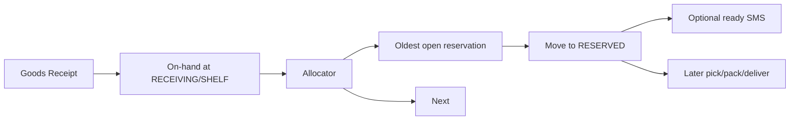

# 05 — Procurement, Replenishment, Pen Warehouse Loop

**Status:** v2 — this is the agency’s operational heart  
**Flag:** `bookCommerce`

[Index](./README.md) · Previous: [Catalog](./04-catalog.md) · Next: [Sales](./06-sales.md)

---

## 1. Real business loop

The agency is not a fully stocked retailer. Typical path:

```text
Student orders
    → Reservation (ATP and/or shortage)
    → Need calculation
    → Purchase Request
    → Purchase Order
    → Excel export
    → Send to Pen warehouse
    → Books arrive
    → Goods Receipt (scan)
    → Reservation fulfilled
```

Handwritten “list for the warehouse” dies here.

---

## 2. Demand math (replenishment engine)

Run on worker (`books:replenishment-once`) and on-demand “محاسبه کمبود”.

Per `(organization, sku, destinationWarehouse)`:

```text
demandOpen        = sum(reservation lines qty still unfilled)
demandPolicy      = reorderPoint protection (optional, from ReorderPolicy)
demandCampaign    = manual/campaign forecast qty (optional)
demand            = demandOpen + demandPolicy + demandCampaign

onHandSellable    = sum(qtyOnHand of ATP locations)
reservedSoft      = sum(qtyReservedSoft)
hardReserved      = sum(qtyOnHand of RESERVED locations for open reservations)
available         = onHandSellable - reservedSoft
incoming          = sum(PO lines qtyOrdered - qtyReceived) for this warehouse

cover             = available + incoming
needPurchase      = max(0, demand - cover)
```

Worked example from the brief:

```text
Demand     = 120
On Hand    = 35
Reserved   = 20
Available  = 15          # 35 - 20
Incoming   = 0
Need       = 105         # 120 - 15
```

Store each run as `ReplenishmentRun` + lines (inputs snapshotted) so managers and future AI can see **why** a PR was born.

Lost sales: reservation expiry or rejected demand increments a counter for analytics (`lostSalesQty`).

---

## 3. ReorderPolicy (per sku × warehouse)

`minQty`, `reorderPoint`, `reorderQty`, `maxQty`, `defaultSupplierId` (Pen), `leadTimeDays`.

Planning may round `needPurchase` up to `reorderQty` or pack sizes (`orderMultiple`).

---

## 4. Purchase Request (internal)

Created from:

- Replenishment run (auto-draft, **not** auto-sent)
- Manual (“this school needs 40 chemistry”)
- Reservation shortage button (“create PR for shorts on this order”)

Statuses: DRAFT → SUBMITTED → APPROVED → CONVERTED_TO_PO / REJECTED / CANCELLED.

Lines: skuId, qtyRequested, qtyApproved, sourceReservationIds[], destinationWarehouseId.

Permission: `books.procurement.approve_pr` for APPROVED.

---

## 5. Purchase Order (external)

Converted from one or more PRs to the **same supplier** (default Pen warehouse).

Statuses: DRAFT → CONFIRMED → SENT → PARTIALLY_RECEIVED → RECEIVED → CLOSED / CANCELLED.

Fields: supplier, expectedAt, destinationWarehouse, notes, `sentAt`, `exportFileAssetId`.

**Excel export** is the integration with Pen (they do not have an API in v1):

- Template columns agreed with operations (internalCode, title, qty, edition, notes).
- Sanitized xlsx.
- Export is a document event (SENT).
- Re-export allowed; versioned files.

There is **no** silent email send required in v1; staff download and send via their existing Pen channel. Optional later: email worker.

---

## 6. Goods Receipt

When books arrive:

1. Open PO → start Receiving scan session.
2. Scan barcodes; qty received ≤ remaining.
3. Post GRN → movements PURCHASE_RECEIPT into RECEIVING (or SHELF if AgencyProfile skip-dock).
4. Decrement PO remaining; decrement `qtyIncoming`.
5. **Allocation pass:** unfilled reservations for that SKU at that warehouse, FIFO by `reservation.createdAt` (or deposit-firm first — AgencyProfile `allocationPolicy`).
6. Hard allocate SHELF/RECEIVING → RESERVED for allocated qty.
7. Domain event `BOOK_RESERVATION_ALLOCATED` → SMS “کتاب شما آماده است” if fully allocated and policy wants it.

Over-receipt: override permission + adjustment reason.

---

## 7. Reservation fulfillment after GRN



Partial: reservation stays OPEN with `qtyAllocated` / `qtyOutstanding`.

---

## 8. Supplier

At least one Supplier: “انبار قلم / Pen Warehouse”. Others (other publishers) allowed. No EDI in v1.

VIRTUAL_SUPPLIER warehouse is **not** required if incoming lives on PO lines only (preferred). Avoid fake on-hand at Pen.

---

## 9. Human-in-the-loop

The engine **never** auto-CONFIRMS a PO in v1. Auto-DRAFT PR is enough. `bookCommerce` later flag `autoApprovePrBelow` is an open question ([13](./13-open-questions.md)).

---

## 10. Failure cases

| Case | Behavior |
|------|----------|
| Pen short-ships | Partial GRN; remaining need stays on PO or new PR |
| Student cancels after PO sent | Reservation release; stock becomes SHELF ATP; optional cancel line to Pen (manual note) |
| Wrong book received | DAMAGED/RETURN path; do not allocate |
| Duplicate Excel sent to Pen | PO export version + staff SOP; system does not block second export, warns |

---

## 11. Admin UX

- **کمبودها:** table SKU, demand, on hand, reserved, available, incoming, need, action [ایجاد درخواست خرید]
- PR/PO kanban
- PO detail: export button, receive button
- Link from reservation line → covering PO line (after convert)
