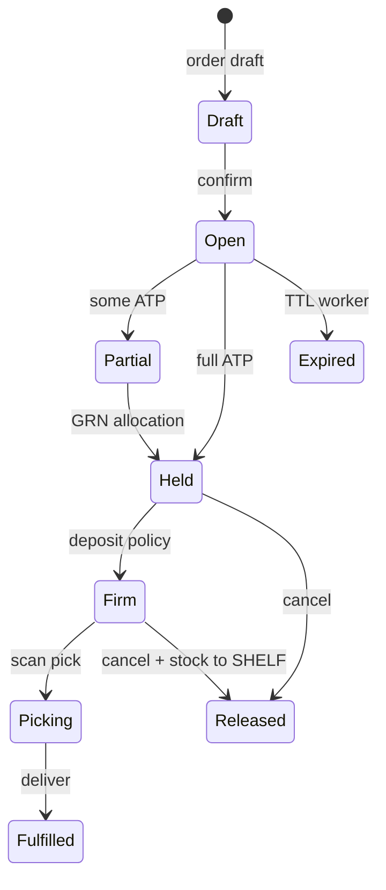
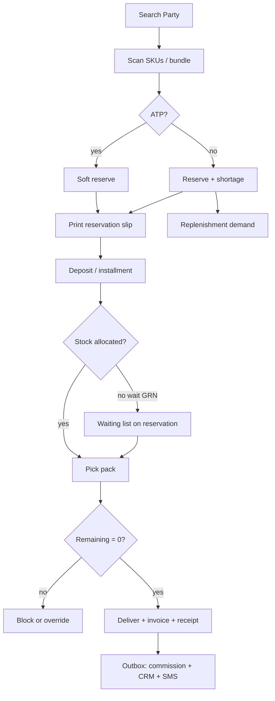

# 06 — Sales, Reservations, Delivery, Commercial Documents

**Status:** v2 — admin ERP first  
**Flag:** `bookCommerce`

[Index](./README.md) · Previous: [Procurement](./05-procurement.md) · Next: [Marketing](./07-marketing.md)

---

## 1. Sales is a document chain, not a cart

Staff capture reality at the desk:

```text
Identify Party (student / guardian / school / walk-in)
  → optional Quotation
  → Sales Order
  → Reservation (+ Reservation Slip)
  → Treasury (deposit / installment / settle)
  → Pick / pack / Delivery Note
  → Invoice + Receipt
  → optional Return Invoice / Credit Note
  → Gift Invoice / Donation Invoice when campaign requires
```

Public checkout is **out of this document** — see [11](./11-public-store.md).

---

## 2. Party on every order (CRM)

Required: `customerPartyId`.  
Optional links (no duplicated names/mobiles): `leadId`, `studentId`, `guardianId`, `schoolPartyId`, `teacherPartnerId`, `consultantPartnerId`.

Capture UX: mobile search → existing Student/Guardian/Lead → else create Party.  
School bulk: customer = school Party; lines may still name students (child table `SalesOrderBeneficiary` optional phase-2; v1 note on line metadata).

Domain events (outbox):

| Event | CRM effect |
|-------|------------|
| BOOK_ORDER_CONFIRMED | CrmActivity on lead/student |
| BOOK_PAYMENT_ALLOCATED | activity + optional task if remaining |
| BOOK_ORDER_FULFILLED | activity |
| BOOK_ORDER_CANCELLED | activity |

Sales does not invent a second pipeline. Existing CRM automations may subscribe later.

---

## 3. SalesOrder

`productLine = BOOK_AGENCY`. Number `BA-1405-000123` via DocumentSequence.

Statuses: DRAFT, CONFIRMED, ON_HOLD, PARTIALLY_PAID, PAID, FULFILLING, CLOSED, CANCELLED.

Lines: sku **or** bundle, qty, price snapshot, discount snapshot, warehouse, qtyReserved, qtyAllocated, qtyIssued, qtyReturned, qtyShort.

Scanner adds lines. Bundle explodes for warehouse, stays one commercial line.

---

## 4. Reservation workflow



Rules:

- Confirm always creates reservation lines (even if qtyShort = qty).
- Shortage still drives replenishment demand.
- TTL configurable; deposit can **firm** (stop expiry) per AgencyProfile.
- Never decrement on-hand at confirm; only reservedSoft or later ALLOCATE_RESERVED.
- Convert to issue only via delivery/pick scan.

Reservation Slip: printable CommercialDocument `RESERVATION_SLIP` with QR of the order, lines, remaining, “not a fiscal invoice.”

---

## 5. Delivery

Methods: PICKUP_ONSITE, SCHOOL_BATCH, INTERNAL_TRANSFER (to another branch for pickup). Courier = phase 2.

DeliveryNote + lines; proof: scan, optional signature (reuse booklet pad **pattern** only when that code exists — do not couple modules), staff id, timestamp.

Block issue if `remainingRials > 0` unless `books.orders.issue_unpaid`.

School batch: one delivery note, many orders, scan school QR / list.

---

## 6. Commercial documents

| Type | When issued | Money |
|------|-------------|--------|
| Quotation | Before commit | No allocations |
| Reservation Slip | On confirm | Shows deposit due |
| Invoice | On fulfill or on request (AgencyProfile `invoiceAt`) | Snapshot of order totals |
| Receipt | Each cash/POS/transfer/online take | Tied to PaymentIntent + allocation |
| Return Invoice | Customer returns books | Triggers RETURN_IN + optional refund |
| Credit Note | Price/correction without goods | Treasury only |
| Gift Invoice | Zero-price / token value grant | May issue from GIFT location |
| Donation Invoice | School donation campaign | Non-AR or AR=0; still warehouse issue |

All numbered, printable A5 RTL, QR verify token (`ADMIN_DOC`). Void ≠ delete.

---

## 7. Returns

Return Invoice → warehouse RETURNED (not SHELF until QC putaway). Commission clawback event. Restock to SHELF is a transfer after inspection.

---

## 8. Sales workflow (end-to-end)



---

## 9. Front-desk UX

Target: under 45 seconds for a known student + one ISBN.

- Sticky مانده
- Scan field always focused
- Large deposit keypad
- Print reservation slip / receipt without leaving the page
- Mobile: same flow stacked; import/reports remain desktop-first

---

## 10. What sales must not do

- Call SMS provider directly (enqueue only)
- UPDATE inventory balances except through warehouse services
- Clone student rows
- Use `/book` URLs
- Share booklet `IN_PRODUCTION` stage
