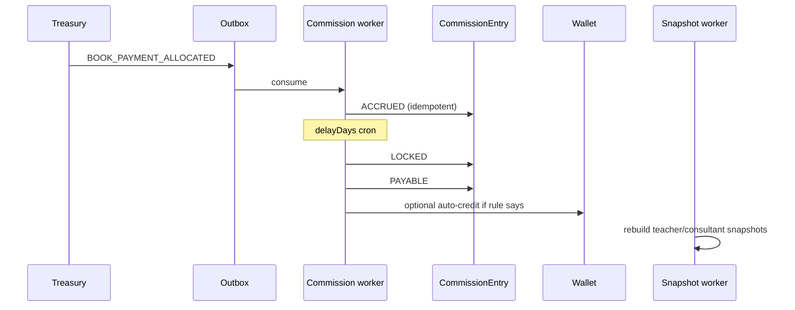

# 08 — Teacher & Consultant Commission Platforms

**Status:** v2 — incentive platforms, not a single affiliate cookie  
**Flags:** `bookCommerce`, `bookCommerce.marketing`, `bookCommerce.partnerPortals` (portals off until later)

[Index](./README.md) · Previous: [Marketing](./07-marketing.md) · Next: [Treasury](./09-treasury.md)

---

## 1. Why this is not “affiliate”

Teachers and consultants are **core sales channels** of a Pen Book Agency. They need:

- Identity (Partner + Party, link User when they log in)
- Standing commission rules + campaign overlays
- Goals, rankings, history
- QR / referral tools
- A **dashboard of their own** (not `/admin`)

Staff still operate payouts in the ERP. Partners never post stock or void invoices.

---

## 2. Commission posting

Worker-only after `BOOK_PAYMENT_ALLOCATED` / `BOOK_ORDER_PAID`.

```text
Attribution snapshot (immutable)
  → match CommissionRule + campaign overlays
  → CommissionEntry ACCRUED (base = PAID amount of eligible lines)
  → delayDays → LOCKED if order not refunded
  → PAYABLE
  → PAID (wallet credit and/or payout batch)
Refund/cancel → VOID or CLAWED_BACK
```

Unique `(organizationId, orderId, partnerId, ruleId)`.

**Never accrue on unpaid remaining.** Default base: paid Rials of eligible SKUs. Optional rule base GMV is an open question (default off).

Self-referral: block partner mobile = customer mobile unless policy (students).

---

## 3. Teacher platform

PartnerType `TEACHER`.

### 3.1 Dashboard metrics (read models)

`PartnerDashboardSnapshot` daily (and month-to-date projection):

| Metric | Meaning |
|--------|---------|
| Sales | Fulfilled qty attributed |
| Revenue | Paid GMV attributed |
| Commission | ACCRUED/LOCKED/PAYABLE/PAID split |
| Goal | PartnerTarget for Jalali month |
| Remaining to goal | max(0, goal − progress) |
| Ranking | Position in teacher leaderboard |
| Monthly history | Last 12 Jalali months |
| Top books | SKUs by attributed qty/GMV |
| Top students | Parties/students attributed (privacy: names only if org policy; else counts) |
| QR / referral links | Active tokens, click/conversion counts |

Snapshots are what the dashboard reads. Live locks stay in commission tables.

### 3.2 Teacher UX (when `partnerPortals` on)

Route family `/partners/teacher` (or portal sub-app) with a **new** session kind or existing User + membership role that is **not** admin. **Do not** reuse student portal cookies for teachers.

Until that flag: staff print QR sheets; dashboard is **admin impersonation view** (manager looks at teacher metrics).

### 3.3 Goals & ranking

`PartnerTarget`: period (Jalali month/term), metric GMV | QTY | NEW_CUSTOMERS, goal value.  
LeaderboardSnapshot daily. Ties: earlier goal-hit, then GMV.

---

## 4. Consultant platform

PartnerType `CONSULTANT`. Independent targets (not mixed on the same leaderboard unless a campaign says so).

Dashboard extras vs teacher:

| Metric | Meaning |
|--------|---------|
| Conversion rate | attributed orders / attributed clicks or referred leads that ordered |
| Student retention | repeat book orders from same student Party in trailing N months |
| Monthly goals | own PartnerTarget rows |
| Commission | own rules (often higher tier) |
| Leaderboard | consultant-only |

Conversion/retention are **insights** computed by the rollup worker from attribution + orders, not CRM stage hacks.

Consultants may already be StarOS `ADVISOR` staff — link Partner.partyId → User. They still should not get warehouse permissions from that.

---

## 5. Commission workflow diagram



Payout batch (staff): select PAYABLE → mark PAID + WalletLedger or external transfer note.

---

## 6. Admin UX

- Commission queue (filters: teacher vs consultant)
- Rule table (partner type, SKU scope, rate, delay)
- Impersonate dashboard (audit)
- Clawback tool (permission `books.commission.manage`)

---

## 7. Privacy

Top students on a teacher dashboard: AgencyProfile `showStudentNamesToTeachers` default **false** (counts + grade only). Full names are an approval item ([13](./13-open-questions.md)).
