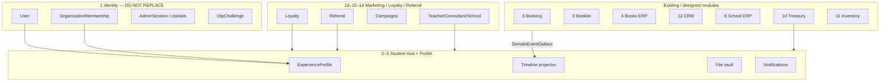

# 02 — Bounded Contexts

[Index](./README.md) · Previous: [Overview](./01-overview.md) · Next: [Domain model](./03-domain-model.md)

SXP **does not merge** these into one database blob. Each context owns writes. The Hub **reads** projections + timeline.

| # | Context | Write owner today / future | Hub relationship |
|---|---------|----------------------------|------------------|
| 1 | **Identity Platform** | `User`, membership, sessions, OTP — **keep** | Login to Hub |
| 2 | **Student Hub** | New Experience Hub UI on `/portal` | The shell |
| 3 | **Profile** | New `ExperienceProfile` + links | Heart |
| 4 | **Book Commerce** | Book Agency ERP (docs; `bookCommerce`) | Orders/books widgets |
| 5 | **Booklet Commerce** | Unmerged `CommerceOrder` ops pipeline | Booklets widget |
| 6 | **Booking** | Existing engine `/book` | Reservations widget |
| 7 | **Consulting** | Booking services + CRM advisors + future course-like offers | Same booking + tagged service kind |
| 8 | **Courses** | Public content today; future enrollment module | Courses widget (placeholder until enrollment exists) |
| 9 | **School ERP** | Students, grades, assessments, guardians (exists) | Academic slice of profile |
| 10 | **Treasury** | `PaymentIntent` + allocations (commerce branch / book ERP) | Payments, remaining, invoices |
| 11 | **Inventory** | Book ERP warehouse ledger; booklet scalar stock | **Not** shown raw to students; only “waiting procurement / ready” |
| 12 | **CRM** | Leads, tasks, SMS — **staff** | Timeline + “your advisor”; no student-writable pipeline |
| 13 | **Marketing** | Campaigns/coupons (book ERP + future) | Coupons, campaigns on hub |
| 14 | **Referral** | New on Profile + Partner links | Referral section |
| 15 | **Loyalty** | New; **not** CMS `Achievement` | Points, tiers, badges |
| 16 | **Notifications** | SMS queue today; add in-app `ExperienceNotification` | Bell + messages |
| 17 | **Reports** | Staff reports | Partner dashboards use snapshots |
| 18 | **Analytics** | Daily rollups | Hub home KPIs from small projections |
| 19 | **AI Recommendation** | New read-only signal tables | “پیشنهادها” |
| 20 | **Administration** | `/admin` | Unchanged IA; may link “open in hub” |

---

## Context diagram

---

## Anti-corruption rules

1. Hub never `UPDATE`s `BookingReservation.status` except via booking services.
2. Hub never posts inventory movements.
3. Hub never changes `Lead.status` except by creating a domain event CRM already understands.
4. Booklet `opsStage` and Book ERP `salesStatus` stay in their modules; Hub maps them to **user-facing** status labels (see [09](./09-module-integrations.md)).
5. Public CMS `Achievement` ≠ Loyalty badge.
6. `/book` remains appointments. Books live under hub **Books** and admin بازرگانی کتاب.
