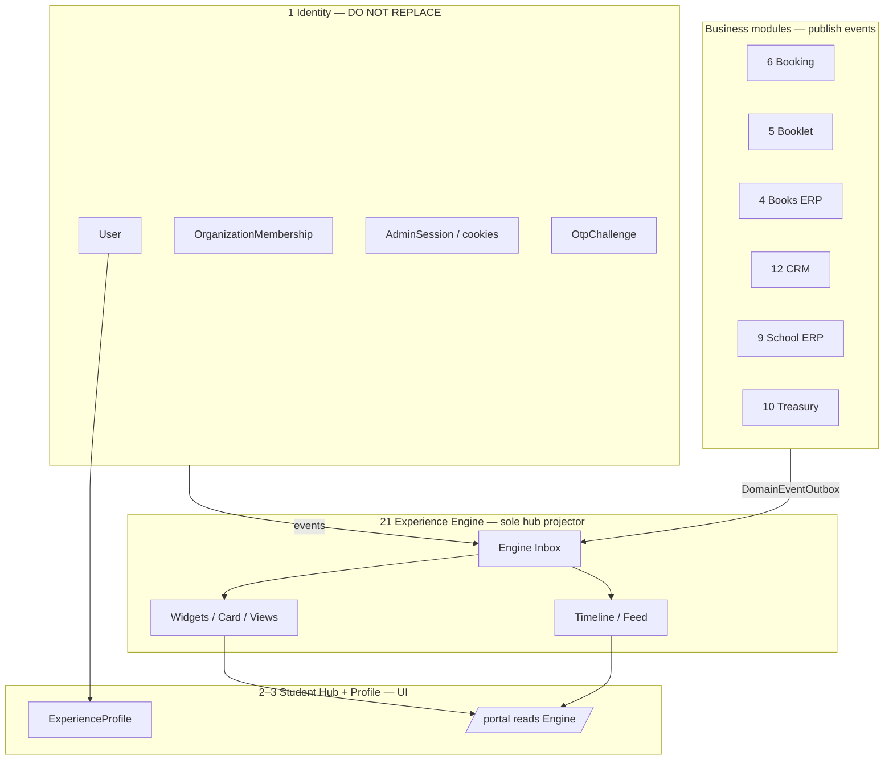

# 02 — Bounded Contexts

[Index](./README.md) · Previous: [Overview](./01-overview.md) · Next: [Domain model](./03-domain-model.md)

SXP **does not merge** these into one database blob. Each **business** context owns its documents. The **Experience Engine** is the **only** consumer that builds the student’s personal hub from events.

| # | Context | Write owner today / future | Hub relationship |
|---|---------|----------------------------|------------------|
| 1 | **Identity Platform** | `User`, membership, sessions, OTP — **keep** | Login; publishes ACCOUNT/LOGIN events |
| 2 | **Student Hub** | UI shell on `/portal` | **Reads Engine only** |
| 3 | **Profile** | `ExperienceProfile` + links | Heart of the UI; not the projector |
| 4 | **Book Commerce** | Book Agency ERP (`bookCommerce`) | Publishes BOOK_ORDER_*; never queried by Hub |
| 5 | **Booklet Commerce** | Unmerged booklet ops | Publishes BOOKLET_*; Hub maps labels via Engine |
| 6 | **Booking** | Existing `/book` | Publishes BOOKING_* |
| 7 | **Consulting** | Booking + advisors | Same as booking events |
| 8 | **Courses** | Content today; enrollment later | Must publish CLASS_* when enroll exists |
| 9 | **School ERP** | Students, assessments, CMS achievements | Publishes academic/file events |
| 10 | **Treasury** | PaymentIntent + allocations | Publishes PAYMENT_* / WALLET_LEDGER_POSTED |
| 11 | **Inventory** | Book ERP ledger | **Not** in hub; books module emits “waiting procurement” |
| 12 | **CRM** | Leads, tasks — **staff** | Optional customer-visible events only |
| 13 | **Marketing** | Campaigns/coupons | Publishes COUPON/GIFT/REFERRAL |
| 14 | **Referral** | Codes on profile | Publishes conversions; Engine shows tools |
| 15 | **Loyalty ledgers** | Points journal (business earn on GMV) | Engine **views**; CMS Achievement ≠ loyalty |
| 16 | **Notifications (SMS)** | `SmsMessage` queue | Engine owns **in-app** bell only |
| 17 | **Reports** | Staff | Partner snapshots, not Hub |
| 18 | **Analytics** | Daily rollups | Staff/AI |
| 19 | **AI Recommendation** | Read-only signals | Hub «پیشنهادها» widget payload |
| 20 | **Administration** | `/admin` | Unchanged |
| **21** | **Experience Engine** | Projections listed in [06](./06-experience-engine.md) | **Sole builder of the personal hub** |

---

## Experience Engine (central)

Owns: Timeline, Activity Feed, Notifications (in-app), Achievements/Badges **views**, Loyalty **views**, Wallet **views**, Quick Actions, Favorites, Recently Viewed, Downloads index, Digital Student Card, Dashboard Widgets.

Does **not** own: orders, stock, leads, payments ledgers, SMS transport, Student rows.

**Contract:** every future module **must publish** `DomainEventOutbox` events. No publish → no hub presence.

Full spec: [06 — Experience Engine](./06-experience-engine.md).

---

## Context diagram

---

## Anti-corruption rules

1. Hub never `UPDATE`s `BookingReservation.status` except via booking services (deep-link).
2. Hub never posts inventory movements.
3. Hub never changes `Lead.status` except via events CRM already understands.
4. Booklet `opsStage` and Book ERP statuses stay in their modules; Engine maps **user-facing** labels.
5. Public CMS `Achievement` ≠ Engine badges.
6. `/book` remains appointments.
7. **No second hub projector** inside booklet, booking, or CRM code.
8. Engine uses its **own inbox** so it does not steal CRM/SMS outbox processing.
