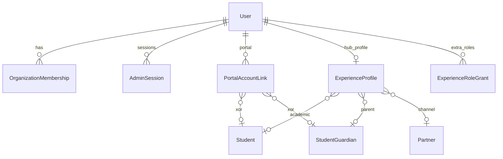
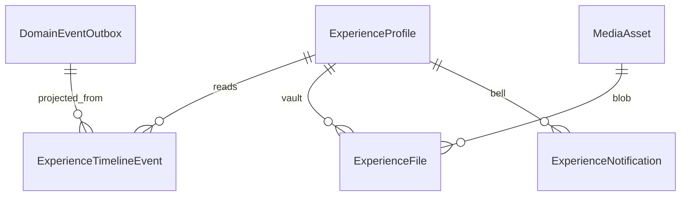
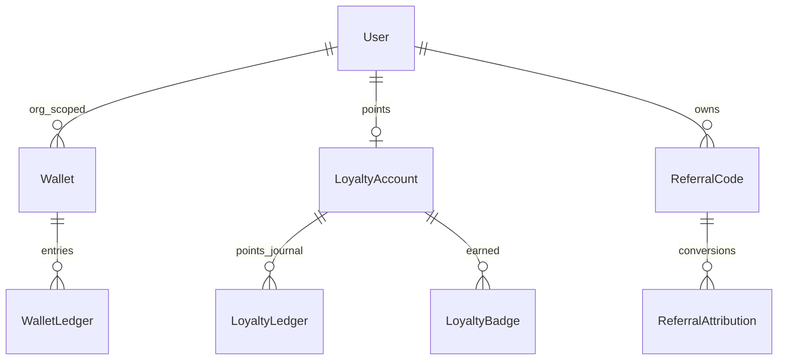

# 03 — Domain Model (logical, no Prisma)

[Index](./README.md) · Previous: [Bounded contexts](./02-bounded-contexts.md) · Next: [Identity](./04-identity.md)

---

## 1. Laws

Same as StarOS: `organizationId` on tenant rows; no unscoped reads; append-only ledgers; integer Rials; UTC; soft-delete masters.

SXP adds **projections**. Source documents remain in their modules.

---

## 2. Identity & profile

**ExperienceProfile** (1 per `organizationId`+`userId`): avatar/photo (MediaAsset), display preferences, education extras (school name free-text vs linked Party), address, emergency contacts, interests[], locale, notification prefs. Personal name/mobile stay on `User` (single edit path).

**ExperienceRoleGrant:** `roleKey`, `grantedBy`, `status`, unique `(org, userId, roleKey)`. Does **not** replace `OrganizationMembership.role`.

---

## 3. Timeline, files, notifications

**ExperienceTimelineEvent:** append-only; `userId`, `organizationId`, `type`, `title`, `summary`, `occurredAt`, `actorType` (USER/STAFF/SYSTEM), `module`, `entityType`, `entityId`, `visibility` (SELF, GUARDIANS, STAFF), `payload` snapshot JSON. Profile **only reads**.

**ExperienceFile:** `kind` RECEIPT | INVOICE | PDF | ASSESSMENT | REPORT | HOMEWORK | DIGITAL_PRODUCT | CERTIFICATE | OTHER; `mediaAssetId`; `sourceModule`; `sourceId`; `visibility`. Generated files are copied/pointed here when created.

**ExperienceNotification:** in-app; may duplicate SMS. Status UNREAD/READ. Not a replacement for `SmsMessage`.

---

## 4. Wallet, loyalty, referral

Wallet owner grain: `(organizationId, userId)` — **one wallet per person per agency**. Partner commission credits **this** wallet (unify with Book ERP; do not create a second partner-only wallet).

Kinds: GIFT_CREDIT, CASHBACK, COMMISSION, MANUAL_ADJUST, REWARD, SCHOLARSHIP. **Not cash tender in v1** (same D5 as Book ERP).

Loyalty tiers: BRONZE, SILVER, GOLD, DIAMOND — computed from points/GMV thresholds in `LoyaltyConfig` (org JSON, versioned). CMS `Achievement` untouched.

---

## 5. Hub projections (not new source of truth)

| Projection | Built from |
|------------|------------|
| HubOrder | Booklet `CommerceOrder` and/or Book `SalesOrder` + payment remaining |
| HubReservation | `BookingReservation` |
| HubPayment | `PaymentIntent` + allocations + commercial documents |
| HubCourse | future enrollment; until then public `content/courses` is browse-only |

Statuses in the Hub are **mapped labels**, stored on the projection for speed, refreshed by the same outbox consumer as timeline.

---

## 6. Indexes (logical)

- Timeline: `(organizationId, userId, occurredAt DESC)`
- Files: `(organizationId, userId, kind, createdAt)`
- Notifications: `(organizationId, userId, status, createdAt)`
- Wallet ledger: unique `(organizationId, idempotencyKey)`
- Role grants: unique `(organizationId, userId, roleKey)`
- Referral code: unique `(organizationId, code)`
