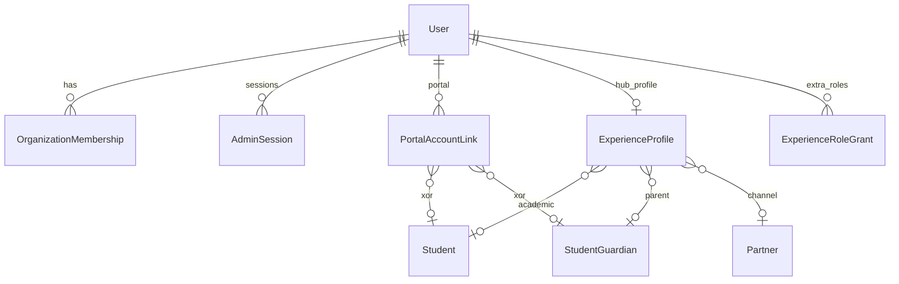
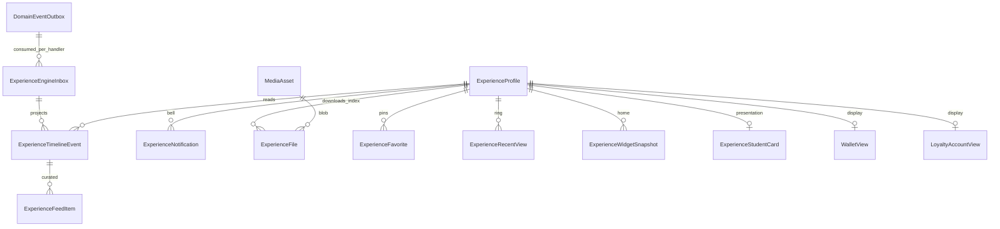
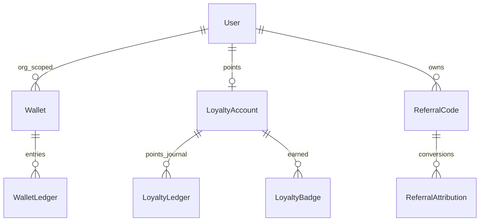

# 03 — Domain Model (logical, no Prisma)

[Index](./README.md) · Previous: [Bounded contexts](./02-bounded-contexts.md) · Next: [Identity](./04-identity.md)

---

## 1. Laws

Same as StarOS: `organizationId` on tenant rows; no unscoped reads; append-only ledgers; integer Rials; UTC; soft-delete masters.

SXP adds the **Experience Engine**: projections and hub-only state. Source documents remain in their modules. The Hub UI does not query those modules for steady-state screens.

---

## 2. Identity & profile

**ExperienceProfile** (1 per `organizationId`+`userId`): avatar/photo (MediaAsset), display preferences, education extras (school name free-text vs linked Party), address, emergency contacts, interests[], locale, notification prefs. Personal name/mobile stay on `User` (single edit path).

**ExperienceRoleGrant:** `roleKey`, `grantedBy`, `status`, unique `(org, userId, roleKey)`. Does **not** replace `OrganizationMembership.role`.

---

## 3. Experience Engine (projections)

Logical store owned by the Engine (not business documents). See [06](./06-experience-engine.md).

**Inbox:** unique `(outboxEventId, handlerName)` — Engine does not monopolize `DomainEventOutbox.status`.

**Timeline / Feed / Notifications / Files:** as before; Profile **only reads**.

**Favorites / Recents / Widgets / Card / Quick Actions:** hub-only; pointers to foreign ids, no copied catalogs.

**WalletView / LoyaltyAccountView:** refreshed from treasury/loyalty **events**, not live SUM of ledgers in HTTP.

**ExperienceTimelineEvent:** append-only; `userId`, `organizationId`, `type`, `title`, `summary`, `occurredAt`, `actorType` (USER/STAFF/SYSTEM), `module`, `entityType`, `entityId`, `visibility` (SELF, GUARDIANS, STAFF), `payload` snapshot JSON. Hub **only reads**.

**ExperienceFile:** `kind` RECEIPT | INVOICE | PDF | ASSESSMENT | REPORT | HOMEWORK | DIGITAL_PRODUCT | CERTIFICATE | OTHER; `mediaAssetId`; `sourceModule`; `sourceId`; `visibility`.

**ExperienceNotification:** in-app; not a replacement for `SmsMessage`.

---

## 4. Wallet, loyalty, referral

Wallet owner grain: `(organizationId, userId)` — **one wallet per person per agency**. Partner commission credits **this** wallet (unify with Book ERP; do not create a second partner-only wallet).

Kinds: GIFT_CREDIT, CASHBACK, COMMISSION, MANUAL_ADJUST, REWARD, SCHOLARSHIP. **Not cash tender in v1** (same D5 as Book ERP).

Loyalty tiers: BRONZE, SILVER, GOLD, DIAMOND — computed from points/GMV thresholds in `LoyaltyConfig` (org JSON, versioned). CMS `Achievement` untouched.

---

## 5. Hub projections (built only by Experience Engine)

| Projection | Event sources (not live tables in HTTP) |
|------------|------------------------------------------|
| HubOrder | BOOKLET_* / BOOK_ORDER_* + PAYMENT_* snapshots |
| HubReservation | BOOKING_* |
| HubPayment | PAYMENT_* / WALLET_LEDGER_POSTED |
| HubCourse | CLASS_* when enrollment exists |

Statuses are **mapped labels** on Engine snapshots. Bootstrap backfill is allowed once; steady state is events.

---

## 6. Indexes (logical)

- Timeline: `(organizationId, userId, occurredAt DESC)`
- Files: `(organizationId, userId, kind, createdAt)`
- Notifications: `(organizationId, userId, status, createdAt)`
- Wallet ledger: unique `(organizationId, idempotencyKey)`
- Role grants: unique `(organizationId, userId, roleKey)`
- Referral code: unique `(organizationId, code)`
