# 06 — Experience Engine

**Status:** Architecture only — before Phase S1  
**Owner:** SXP Experience Engine bounded context  
**Rule:** The engine **does not own business data**. It is the **only** consumer that builds the student’s personal hub.

[Index](./README.md) · Previous: [Profile hub](./05-profile-hub.md) · Next: [Wallet ledgers](./07-wallet-loyalty-referral.md)

Timeline (legacy section): [06-timeline stub](./06-timeline.md) — content lives here.

---

## 1. Why this context exists

Modules (booking, CRM, booklet, books, treasury, school ERP, marketing, identity) own **documents and ledgers**.

The Hub must not UNION those tables on every request, and it must not become a second CRM.

**Experience Engine** sits in between:

```text
Every module  --publishes-->  DomainEventOutbox
                                    │
                                    ▼
                         EXPERIENCE ENGINE
                         (sole hub projector)
                                    │
                                    ▼
                    Personal hub read models
                    (timeline, feed, widgets, …)
                                    │
                                    ▼
                         Student Hub UI (/portal)
                              reads only
```

If a future module does not publish events, **it does not appear in the hub.** No special-case queries from the Hub into that module’s tables (except a documented bootstrap backfill).

---

## 2. Owns vs does not own

### 2.1 The Engine owns (experience read models + hub-only state)

| Surface | Meaning |
|---------|---------|
| **Timeline** | Append-only personal history |
| **Activity Feed** | Curated, hub-facing slice of the timeline (Home) |
| **Notifications** | In-app bell (not SMS transport) |
| **Achievements** | Experience-layer achievements view (plus projection of CMS achievements) |
| **Badges** | Earned badge projections |
| **Loyalty** | Tier/points **views** and experience earn rules driven by events |
| **Wallet Views** | Display balances/history — **not** the money ledger |
| **Quick Actions** | Personalized CTA list for Home |
| **Favorites** | User-pinned services, SKUs, consultants, files |
| **Recently Viewed** | Last N public/hub resources |
| **Downloads** | Download list / receipts-as-files index |
| **Digital Student Card** | Presentation of identity + student link (QR) |
| **Personal Dashboard Widgets** | Home layout + widget snapshots |

These are **projections and preferences**, not orders, stock, leads, or payments.

### 2.2 The Engine does not own (business data)

| Data | Owner |
|------|--------|
| `User`, sessions, OTP | Identity |
| `BookingReservation`, slots | Booking |
| `CommerceOrder` / booklet ops | Booklet |
| Book SKUs, warehouse, PR/PO | Book Commerce ERP |
| `Lead`, CRM tasks | CRM |
| `Student`, assessments, CMS `Achievement` | School ERP |
| `PaymentIntent`, allocations, remaining | Treasury |
| Wallet **ledger** (credits/debits) | Wallet/Treasury (see [07](./07-wallet-loyalty-referral.md)) |
| Inventory movements | Inventory |
| SMS send pipeline | Communication |

The Hub **never** `UPDATE`s those tables. Quick Actions may **deep-link** to a Server Action that belongs to the owning module (e.g. cancel via booking service).

---

## 3. Publish contract (mandatory for every future module)

Every bounded context that wants hub presence **must**:

1. Append a `DomainEventOutbox` row in the **same transaction** as the business write (or immediately after with an idempotency key).
2. Set `organizationId`, `eventType`, `payload` including `userId` and/or resolvable `studentId` / `mobile`.
3. Never require the Engine to parse that module’s private tables for ongoing updates.
4. Keep payloads **snapshots** (status, title, amountRials, trackingCode) — not live joins.
5. Use additive `DomainEventType` values (do not rename existing `BOOKING_*` / `FORM_*`).

**Resolution:** Engine maps payload → `userId` via User / PortalAccountLink / Student. If unresolved, event is dead-lettered to an engine poison list (not lost from outbox).

**Forbidden:** Hub pages calling `prisma.bookingReservation.findMany({ where: { mobile } })` as the long-term design. S3 may bootstrap a backfill; steady state is events only.

---

## 4. Sole consumer for the personal hub

Other consumers of the outbox **may** exist (CRM automation, SMS worker, Book ERP replenishment). They must **not** build student hub screens.

| Consumer | Purpose |
|----------|---------|
| **Experience Engine** | **Only** builder of `/portal` hub read models |
| CRM automation worker | Staff pipeline (existing) |
| `communication:worker-once` | SMS (existing) |
| Book ERP workers | Stock/commission (sibling pack) |

Do not add a second “student dashboard projector” in booklet or booking code.

---

## 5. Pipeline

```text
DomainEventOutbox PENDING
  → sxp:experience-engine-once   (replaces the name timeline-projector)
  → handlers (idempotent per outbox id + handler name):
        TimelineAppender
        FeedCurator
        NotificationFanout
        LoyaltyProjector
        BadgeProjector
        AchievementProjector
        WalletViewRefresher
        WidgetSnapshotter
        DownloadIndexer
        QuickActionRecomputer
        StudentCardRefresher
  → mark outbox PROCESSED (engine cursor, not exclusive to other workers)
```

**Multi-consumer outbox:** existing CRM/SMS workers already process some types. Engine must use **its own cursor / processed-set** (`ExperienceEngineInbox` unique `(outboxEventId, handler)`) so it does not steal events from CRM. Do **not** mark the shared outbox PROCESSED unless we introduce a per-consumer inbox — **preferred: per-consumer inbox**, leave `DomainEventOutbox` semantics as today for CRM.

Open question Q13: shared outbox status vs inbox table. **Default:** `ExperienceEngineInbox` so we do not break CRM automation.

User-originated hub actions (favorite, view, dismiss widget) write **engine tables only**, then optionally emit `SXP_FAVORITE_ADDED` for the same pipeline (timeline).

---

## 6. Surface specs

### 6.1 Timeline

Append-only `ExperienceTimelineEvent`. Full catalog: see table in [§8](#8-minimum-event-catalog). Profile/Hub **only reads**. Not `CrmActivity`, not `AuditLog`. Visibility SELF / GUARDIANS / STAFF / SYSTEM_HIDDEN. No SMS body text.

### 6.2 Activity Feed

Not a second log. Derived from timeline with `feedEligible=true`, ranking (actionable first, then recency), capped (e.g. 20). Home uses Feed; Timeline section uses the full log.

### 6.3 Notifications

`ExperienceNotification` in-app. SMS remains Communication. Engine may enqueue SMS via existing queue **only** by calling communication APIs, never by owning `SmsMessage` writes if that duplicates the worker — prefer: Engine creates in-app row; SMS already sent by module.

### 6.4 Achievements & badges

| Kind | Source | Engine role |
|------|--------|-------------|
| School CMS `Achievement` | School ERP | Project into hub Achievements tab |
| Experience achievement / badge | Engine rules on events | Own definition + earned rows |

Do not overload CMS `Achievement`.

### 6.5 Loyalty (views)

Engine **projects** `LoyaltyAccountView` (tier, points, progress). Point **posting** to `LoyaltyLedger` may be performed by the Engine **as an experience side effect of events** (e.g. +10 on booking completed) **or** by Treasury on paid GMV. Business GMV points stay with treasury/sales events; Engine still **displays** them. Engine must not invent Rial balances.

### 6.6 Wallet Views

`WalletView`: bucket totals + last N lines **copied** from WalletLedger at event time. Engine does not INSERT ledger credits except if a documented experience reward rule says so (then it must call Wallet service, not SQL-on-ledger).

### 6.7 Quick Actions

Computed list: `{ code, label, href, module, priority }`. Examples: پرداخت مانده، دانلود رسید، رزرو مشاوره، دریافت جزوه. Recomputed on relevant events. Max 3 on Home.

### 6.8 Favorites

Engine-owned: `(userId, orgId, targetType, targetId)`. Types: BOOKING_SERVICE, BOOK_SKU, BOOKLET_ITEM, CONSULTANT, FILE, COURSE. **Pointers only** — no copied catalog.

### 6.9 Recently Viewed

Engine-owned ring buffer (last 20) of public/hub resources. Written from hub loaders (not from admin). TTL optional.

### 6.10 Downloads

Index of `ExperienceFile` / MediaAsset the user may download. Modules emit `FILE_READY`; Engine indexes. Bytes stay on `STAROS_MEDIA_ROOT`.

### 6.11 Digital Student Card

Presentation only: name, grade, org, portrait, portal QR (token namespaced `SXP_CARD`). Not a government ID, not a new Student row. Parent sees cards of authorized children.

### 6.12 Personal Dashboard Widgets

Layout: `(userId, orgId, widgetKey, sortOrder, hidden)`.  
Snapshots: `{ widgetKey, payloadJson, refreshedAt }` filled by WidgetSnapshotter (next reservation, remaining Rials, points, booklet ready count). Hub Home **reads snapshots**, not live ERP.

Default widget set: NextAction, UpcomingReservation, OpenBalance, LoyaltyChip, ReadyPickup, RecentFeed.

---

## 7. Identity of the engine in the map

```mermaid
flowchart LR
  subgraph publishers["Publishers — own business data"]
    ID[Identity]
    BK[Booking]
    BL[Booklet]
    BO[Books]
    CR[CRM]
    ER[School ERP]
    TR[Treasury]
    MK[Marketing]
  end

  publishers -->|DomainEventOutbox| EE[Experience Engine]

  subgraph eeOwns["Engine-owned projections"]
    TL[Timeline]
    AF[Activity Feed]
    NT[Notifications]
    AC[Achievements / Badges / Loyalty views]
    WV[Wallet Views]
    QA[Quick Actions]
    FV[Favorites / Recents]
    DL[Downloads]
    SC[Student Card]
    WG[Widgets]
  end

  EE --> eeOwns
  eeOwns --> HUB[Student Hub UI]
```



Student Hub (context 2 in the original list) is **presentation**. Experience Engine is **the projector**.

---

## 8. Minimum event catalog

| type | Publisher | Engine handlers |
|------|-----------|-----------------|
| ACCOUNT_CREATED / LOGIN | Identity | Timeline, Card |
| BOOKING_* | Booking | Timeline, Feed, Widgets, Quick Actions, Loyalty |
| FORM_SUBMISSION_RECEIVED | Forms | Timeline |
| BOOKLET_ORDER_* / STAGE | Booklet | Timeline, Feed, Widgets, Downloads |
| BOOK_ORDER_* | Books | Timeline, Feed, Widgets, WalletView |
| PAYMENT_ALLOCATED | Treasury | Timeline, WalletView, Quick Actions |
| WALLET_LEDGER_POSTED | Treasury | WalletView |
| FILE_READY | Any | Downloads, Notifications |
| CLASS_JOINED | Courses | Timeline, Widgets |
| CMS_ACHIEVEMENT_PUBLISHED | School ERP | Achievements view |
| COUPON_REDEEMED / GIFT_RECEIVED / REFERRAL_COMPLETED | Marketing | Timeline, Loyalty, Badges |
| SMS_SENT | Communication | Timeline (no body) |
| SXP_FAVORITE_ADDED / SXP_VIEWED | Engine | Timeline optional |

Existing outbox enums stay; map in the Engine. Add types with `ADD VALUE` only.

---

## 9. UX mapping (Hub reads engine)

| Hub section | Engine surface |
|-------------|----------------|
| Home | Widgets + Feed + Quick Actions + Card strip |
| Timeline | Timeline |
| Notifications | Notifications |
| Achievements | Achievements + Badges + CMS projection |
| Points | Loyalty view |
| Wallet | Wallet View |
| Files | Downloads |
| Profile | Identity + Card |

Favorites / Recents: Home modules or a «علاقه‌مندی‌ها» subsection.

---

## 10. Performance & isolation

- Hub HTTP: keyset on timeline; widgets from snapshot rows only.
- Engine worker: batch outbox, per-handler idempotency.
- No engine query into inventory balances.
- Failure in one handler must not block others (inbox per handler).

---

## 11. Phase implication (before S1)

S1 is **not** “a timeline table bolted onto portal.” S1 **is** Experience Engine v0:

- Inbox + TimelineAppender + FeedCurator + WidgetSnapshotter (Home) + Profile
- Existing BOOKING / FORM / SMS events only
- Other handlers empty no-ops until later phases

See [12](./12-roadmap-migration-risks.md).
