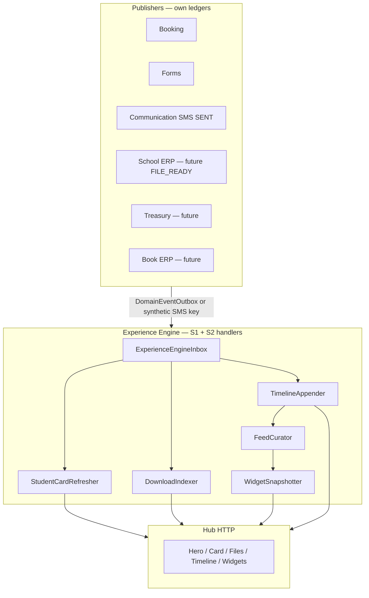

# 04 — Events, projections, data & API contracts

[Index](./README.md) · Previous: [Nav](./03-navigation-and-components.md) · Next: [Risks](./05-risks-flags-rollout.md)

Logical contracts only. **No Prisma in this approval cycle.** When S2 is approved, migrations must be additive on S1 tables.

---

## 1. Event flow



CRM automation and `communication:worker-once` **unchanged**. Engine never sets `DomainEventOutbox.status`.

---

## 2. Event catalog (S2 vs later)

### S2 consumes

| type | Source | Handlers |
|------|--------|----------|
| Existing `BOOKING_*` / `FORM_SUBMISSION_RECEIVED` / `FORM_DUPLICATE_DETECTED` | S1 | Timeline, Feed, Widgets, **Card** (refresh identity chips if payload identifies user) |
| Synthetic `SMS_SENT` | S1 | Timeline (no body); skip OTP |
| **`FILE_READY`** (additive enum **when a publisher exists**) | School ERP / booking receipt / future commerce | DownloadIndexer, Timeline, optional Notification no-op until S9 |

If no module can emit `FILE_READY` yet, **do not** add the enum in a vacuum. Ship files UI empty + indexer wired. First publisher (likely assessment certificate or booking PDF) lands with the `ADD VALUE` in the **same** implementation PR as that publisher — or S2 ships the indexer and a later PR adds the type. Prefer **one additive `DomainEventType` in the S2 PR only if a real writer is included**. Otherwise indexer is idle and vault stays empty (honest).

### Later (do not add in S2 unless publisher+phase)

`BOOK_ORDER_*`, `BOOKLET_*`, `PAYMENT_*`, `WALLET_LEDGER_POSTED`, `CMS_ACHIEVEMENT_*`, `CLASS_*`, `COUPON_*`, `REFERRAL_*`, `SXP_FAVORITE_*`, `ACCOUNT_*`.

Timeline titles stay Persian, payload snapshots only, no PII (mobile, national id, SMS body).

---

## 3. Projection model

S1 tables remain. S2 **adds** Engine-owned rows (when approved):

| Projection | Grain | Written by | Read by Hub |
|------------|-------|------------|-------------|
| `ExperienceTimelineEvent` | `(org, userId, sourceEventId)` | TimelineAppender | Timeline, feed |
| `ExperienceWidgetSnapshot` | `(org, userId, widgetKey)` | WidgetSnapshotter | Home |
| `ExperienceProfile` | `(org, userId)` | Hub ensure + profile edits | Hero |
| **`ExperienceStudentCard`** | `(org, userId, studentId?)` | StudentCardRefresher | Card page / hero |
| **`ExperienceFile`** | `(org, userId, sourceFileId)` | DownloadIndexer | Files |

Card snapshot payload (logical JSON):

```text
{
  displayName, organizationName, branchName?,
  gradeName?, schoolYear?, portraitStorageKey?,
  qrTokenHash, qrExpiresAt?,
  completionRatio  // 0–1 from filled profile fields
}
```

File index payload:

```text
{
  title, mime, sizeBytes, mediaStorageKey,
  kind: RECEIPT | CERTIFICATE | INVOICE | BOOKLET | OTHER,
  sourceType, sourceId,
  visibility: SELF | GUARDIANS
}
```

Widget keys: keep S1 six. S2 may add `FILES_READY` snapshot `{ count }` — **not** `OPEN_BALANCE` live data.

`phase_s1_unavailable` may be renamed in UI to «به‌زودی» but **do not** fill those widgets from ERP.

---

## 4. Data contracts (Hub DTOs)

All loaders: `(PortalContext) → DTO`. Never accept `userId` from the query string as authority.

**ExperienceHomeDto** (extend S1): + `card: CardStripDto | null`, + `filesCount: number`.

**ExperienceCardDto:** fields above; parent: `cards[]` for `authorizedStudents` the viewer may see.

**ExperienceFileDto:** list + cursor `{ occurredAt, id }`.

**ExperienceTimelineDto:** S1 items + `nextCursor` + `dayKey` (Jalali date string for grouping in the loader or view).

Visibility: S1 `SELF | GUARDIANS` for hub. `STAFF` / `SYSTEM_HIDDEN` excluded. Parent **S2 card** uses authorized students; parent **timeline** still own `userId` until S3 fan-out (do not silently mix).

---

## 5. API contracts

No public REST gateway (parent [10](../10-permissions-api-data.md)).

| Surface | Style | Notes |
|---------|--------|--------|
| Home / timeline / card / files pages | Server Components + loaders | `force-dynamic` like portal |
| Cover / avatar upload | Existing media Server Actions | Reuse library; write `ExperienceProfile` pointers |
| File download | Route Handler `GET /portal/files/[id]` | Auth + org + user + guardian flags; no open `/media` guess |
| Card QR image | Route Handler or inline `qrcode` | Token hashed at rest |
| Engine | `npm run sxp:experience-engine-once` | Register new handlers in the same worker |
| Profile field edit | Server Action | `ExperienceProfile` only |

Deep links: `/book/...` for reschedule **is** booking, not Hub SQL.

---

## 6. Identity resolution (worker)

Keep S1: reservation/submission/SMS mobile → `User` with membership **or** portal link in org. Unresolved → inbox `SKIPPED` `unresolved_user`. Card refresher uses `PortalAccountLink` STUDENT + `Student` row for grade/portrait — **worker/backfill**, not Hub `findMany` on booking.

One-time backfill (Q14) for cards/files: documented script, not request path.

---

## 7. Permissions

S2 Hub continues **PortalAccountLink** gates (`requireStudentPortalAccess` / guardian). Do not require `hasPermission("portal.student.access")` until a dedicated cutover.

Downloads: additionally `canViewCertificates` for `kind=CERTIFICATE`; academic files follow `canViewAcademicData`.

Staff must not read student Hub DTOs via these routes.
