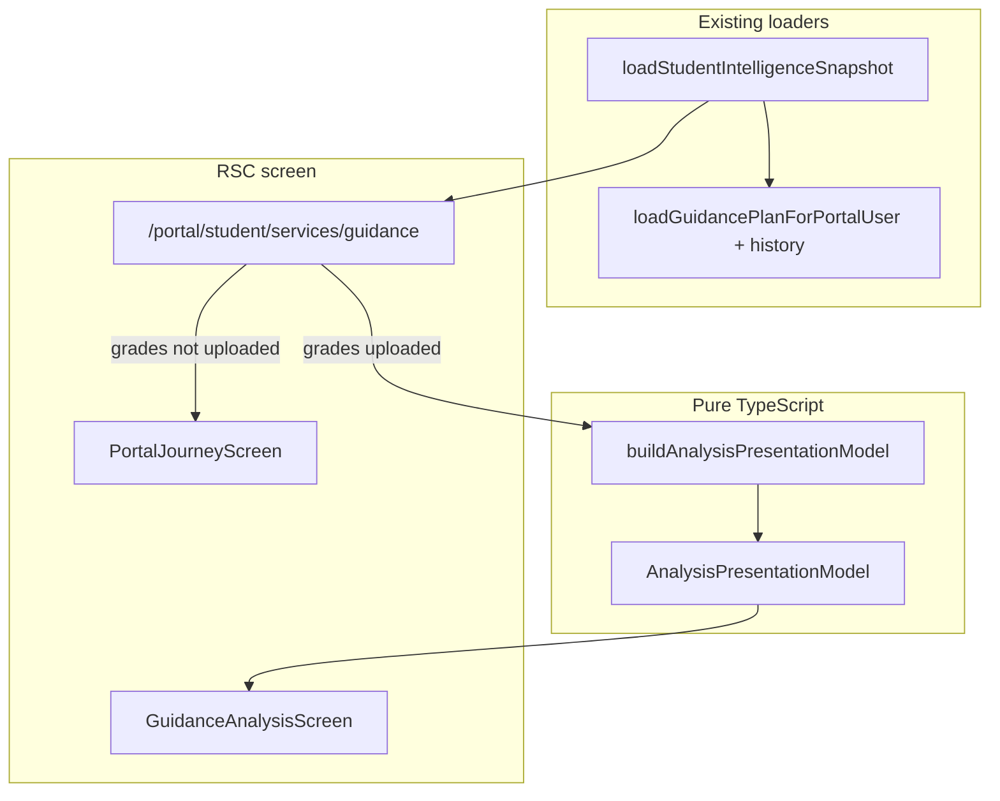

# Guidance Initial Analysis Center (Phase 5)

Transforms the post–grades-upload wait into a structured **Initial Analysis** dashboard.

**Not AI. Not probability. Not a new recommendation product.**  
Rule-based presentation only. Future AI replaces values inside `AnalysisPresentationModel`.

## Constraints honored

- No OTP / workflow / upload-action changes
- No new routes (mounted on `/portal/student/services/guidance`)
- No Prisma schema redesign (history via existing `GuidanceDocument` versions)
- No new packages
- Portal chrome / Home / Intelligence contracts unchanged aside from additive plan history fields

## Architecture

## Data flow

1. RSC page loads the shared intelligence snapshot (one fan-out).
2. If plan has final grades → `buildAnalysisPresentationModel(...)`.
3. Screen renders sections from the model only (no calculations in JSX).
4. Insights stay empty until a real provider fills `insights.items`.

## Sections → model fields

| Section | Model |
|---------|--------|
| Academic Summary | `academic` |
| Uploaded Grades | `grades` (latest + history + replace CTA) |
| Analysis Status | `analysisStatus` (`waiting` / `processing` / `ready` / `needs_review`) |
| Student Journey | `journey` |
| Preparation Checklist | `checklist` |
| Insights | `insights` (empty + `futureSlots`) |
| Recommendations | `recommendations` (rules, `source: "rules" \| "ai"`) |

## Analysis Card contract

Every card: **Icon · Title · Status · Description · CTA** (`AnalysisCardModel`).

## Future AI insertion points

Without redesigning the screen:

1. `insights.items` — rank estimation, probability, AI explanation, quota, university fit (`futureSlots`)
2. `recommendations[].source = "ai"` — swap ranking provider
3. `academic.averageValue` — transcript OCR / verified GPA
4. `academic.graduationValue` — official graduation status
5. `analysisStatus` — counselor/pipeline events beyond document verification

## Performance

- Server Components first
- Reuses snapshot (no duplicated plan query on the guidance page)
- Document history included in the same `loadGuidancePlanForPortalUser` select
- Pure CPU mapping after load

## Files

- `lib/guidance/analysis/*` — types + mapper
- `components/guidance/analysis/*` — screen + card
- `app/portal/student/services/guidance/page.tsx` — mount switch
- `lib/guidance/portal.ts` — additive `finalGradesHistory`
