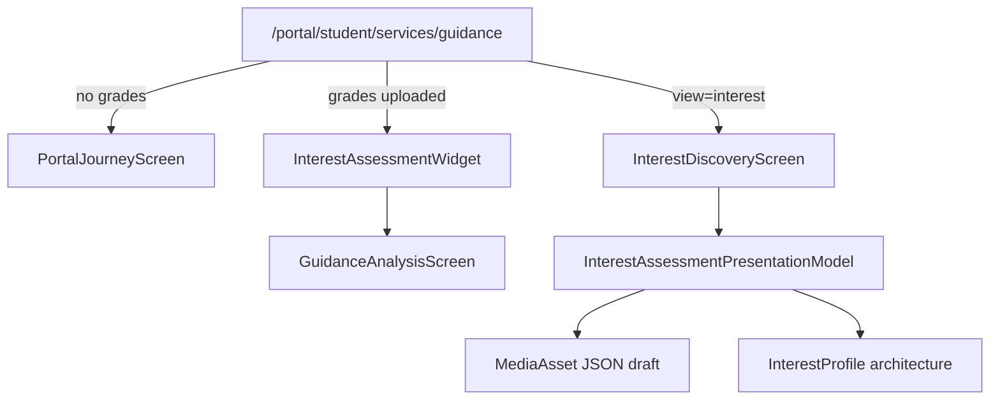

# Guidance Interest Discovery Center (Phase 6)

Premium multi-step Interest Assessment (RIASEC journey architecture).  
**Not AI. Not a recommendation engine. Not university prediction.**

## Constraints honored

- No Portal OS architecture redesign
- No Guidance Journey redesign (additive unlock + CTA only)
- Initial Analysis Center kept; interest widget mounted above it
- No OTP / upload / GuidancePlan schema changes
- No new routes — uses `/portal/student/services/guidance?view=interest`
- Existing plan loader unchanged; interest session is a separate MediaAsset JSON store
- No new npm packages

## Architecture

## Presentation model

`InterestAssessmentPresentationModel` (pure TS):

- progress ring + section progress + remaining time
- question cards (single / multi / scale / priority / card / image slot / drag-drop future)
- review + completion
- `InterestProfile` empty premium bands
- dashboard widget model

## Assessment journey

Introduction → Career Interests → Learning Style → Personality → Working Preferences → Review → Completed

Autosave: every answer → Server Action → private MediaAsset JSON (resume later, no GuidancePlan mutation).

## Future AI / framework insertion

`futureFrameworks`: RIASEC · Holland Codes · Big Five · Multiple Intelligence · AI Career Advisor · University Matching  
Fill `InterestProfile` bands without redesigning the screen.

## Performance

- Server Components for page orchestration
- Client only for the interactive journey
- One interest session read on the guidance page
- Reuses intelligence snapshot for plan/profile (no duplicated plan query)

## Files

- `lib/guidance/interest/*`
- `components/guidance/interest/*`
- `app/portal/student/services/guidance/interest-actions.ts`
- checklist / timeline unlock for `INTEREST_ASSESSMENT`
