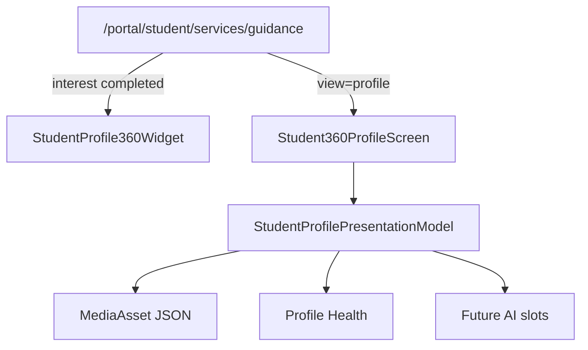

# Student 360° Profile (Phase 7)

Digital identity for Guidance ERP — **not** a CRUD edit-profile page.

## Constraints honored

- No Portal OS / Journey / Analysis / Interest Discovery redesign
- No OTP, uploads, GuidancePlan schema, or new top-level routes
- Mounted on `/portal/student/services/guidance?view=profile`
- Unlocks after Interest Discovery completes
- No new packages; MediaAsset JSON session (same pattern as Interest)

## Architecture

## Sections

Personal · Academic · Family · Educational Goals · University Preferences · Study Habits · Strengths · Weaknesses · Learning Challenges · Achievements · Languages · Skills · Extracurricular · Future Documents (architecture) · Emergency Contacts

## Experience

- Completion score + large progress ring
- Health: Excellent / Good / Incomplete / Critical
- Missing cards · recommended actions · recent changes · quick edit
- Section Edit / Save / Cancel (+ autosave architecture note)

## Journey

`PROFILE_COMPLETION` unlocks when Interest is `completed`.  
Marks complete at ≥80% or explicit “ثبت آمادگی”.

## Future AI insertion points

`career_advisor` · `university_matching` · `scholarship_matching` · `counselor_insights` · `academic_risk`

## Performance

Server Components orchestrate; client only for section editors; one profile session read alongside interest session; reuses intelligence snapshot for seed identity fields.
