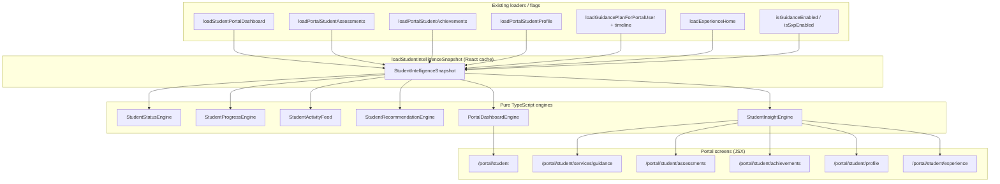
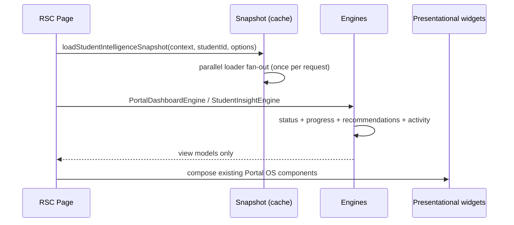

# Portal Intelligence Layer (Phase 5)

Architecture-first layer that feeds every Student Portal screen with **view models**.
No AI yet. No React/JSX inside engines. No schema redesign.

## Architecture diagram

## Data flow

## Module → engine map

| Module | Primary engine | Consumes |
|--------|----------------|----------|
| Home | `PortalDashboardEngine` | snapshot → hero, progress, actions, modules, recommendations, activity, status |
| Guidance | `StudentInsightEngine.guidance` | journey model, progress, next action, status |
| Assessments | `StudentInsightEngine.assessments` | insights + results + status |
| Achievements | `StudentInsightEngine.achievements` | trophy insights + status |
| Profile | `StudentInsightEngine.profile` | completion progress + status (+ SXP strip still via existing hub loader) |
| Experience | `StudentInsightEngine.experience` | home DTO + architectural level/XP/reward slots |

Supporting engines used by the above:

- `StudentStatusEngine` — healthy / needs_attention / blocked / waiting / completed
- `StudentProgressEngine` — percent / phase / remaining
- `StudentActivityFeed` — chronological unified feed
- `StudentRecommendationEngine` — 1 primary + up to 3 secondary (rule-based)

## Widget contract

`PortalWidgetModel`:

- `title`, `status`, `priority`, `actions`, `content`, `empty*`
- optional Portal OS hints: `module`, `accent`, `icon`

Mapper: `portalWidgetModelToProps` → existing `PortalWidget` props (no visual redesign).

## Future AI insertion points

1. **`StudentRecommendationEngine`** — swap ranking/source to `source: "ai"` while keeping `PortalRecommendationBundle`.
2. **`StudentActivityFeed`** — append `kind: "ai_event"` items from an AI event store.
3. **`StudentInsightEngine`** — attach model scores / explanations on assessment/guidance models without changing screen props.
4. **`PortalDashboardEngine.buildHome`** — optional AI headline override for Home hero support line.
5. **Widget `content`** — opaque payload reserved for AI-enriched blocks rendered by future presenters.

## Performance notes

- Snapshot uses React `cache()` → one fan-out per request even if multiple engines run.
- Pages pass `IntelligenceLoadOptions` to skip unused loaders (Guidance skips assessments/achievements/experience).
- Engines are pure CPU over already-loaded DTOs — no extra Prisma round-trips.
- No new packages.

## Technical debt reduced

- Removed per-page duplicated guidance/timeline/flag loading on Home.
- Centralized status vocabulary (widgets no longer invent ad-hoc states).
- Single recommendation + activity construction path for Home.
- Guidance hero/progress/summary already shared a journey model; now always produced via InsightEngine from the same snapshot type.

## Validation constraints honored

- No visual redesign
- No business-logic / workflow changes
- No Prisma schema changes
- No feature-flag semantics changes
- No new npm packages
